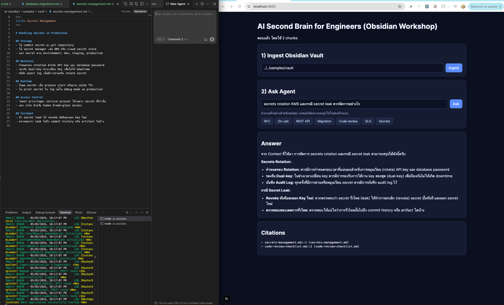
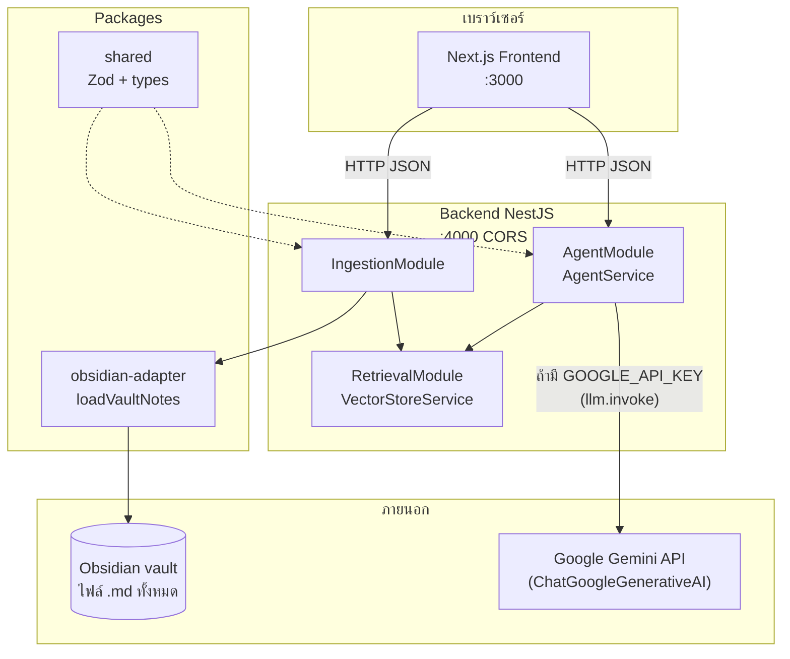
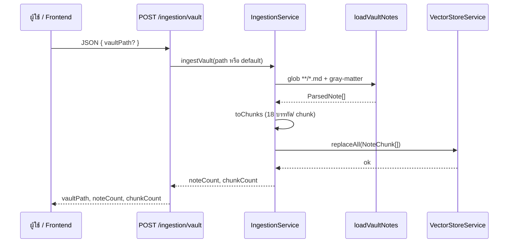
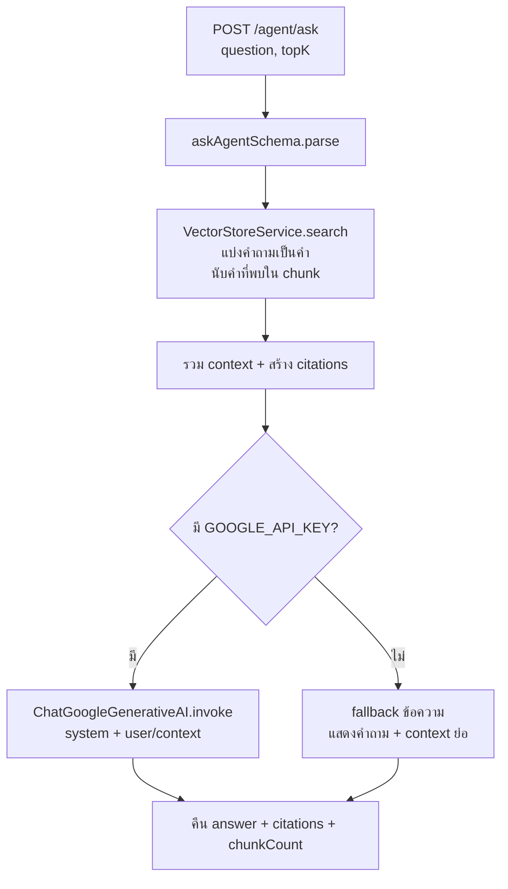

# AI Obsidian — Second Brain สำหรับวิศวกร (Workshop)

โปรเจกต์นี้เป็น monorepo สำหรับ workshop: นำเข้า Obsidian vault (Markdown) เข้าสู่ระบบ แบ่งเป็นชิ้นย่อย (chunks) เก็บในหน่วยความจำชั่วคราว แล้วให้ Agent ตอบคำถามแบบอ้างอิงแหล่งที่มา (citations) ได้

## Table of Contents

- [ภาพรวม](#ภาพรวม)
- [Screenshots](#screenshots)
- [Obsidian: จำลอง vs ใช้งานจริง และนามสกุลไฟล์](#obsidian-จำลอง-vs-ใช้งานจริง-และนามสกุลไฟล์)
- [การทำงานละเอียด — ตั้งแต่ส่งคำถามจนถึงคำตอบ](#การทำงานละเอียด--ตั้งแต่ส่งคำถามจนถึงคำตอบ)
- [โครงสร้างโปรเจกต์](#โครงสร้างโปรเจกต์)
- [Tech Stack](#tech-stack)
- [การเริ่มต้น](#การเริ่มต้น)
- [ไดอะแกรมสถาปัตยกรรม](#ไดอะแกรมสถาปัตยกรรม)
- [ไดอะแกรม flow — Ingestion](#ไดอะแกรม-flow--ingestion)
- [ไดอะแกรม flow — ถามคำถามแบบ RAG-style](#ไดอะแกรม-flow--ถามคำถามแบบ-rag-style)
- [โมดูล Backend](#โมดูล-backend)
- [API Endpoints](#api-endpoints)
- [คำถามทดสอบจาก sample vault](#คำถามทดสอบจาก-sample-vault)
- [ข้อจำกัดและหมายเหตุสำหรับ Workshop](#ข้อจำกัดและหมายเหตุสำหรับ-workshop)

## ภาพรวม

ระบบประกอบด้วย **Frontend (Next.js)** ที่เรียก **Backend (NestJS)** ผ่าน HTTP JSON API

1. **Ingestion**: ผู้ใช้ส่ง `POST /ingestion/vault` พร้อม path ของ vault (หรือปล่อยว่างเพื่อใช้ค่าเริ่มต้น) — Backend ใช้แพ็กเกจ `obsidian-adapter` อ่านไฟล์ตาม **`VAULT_GLOB`** (ค่าเริ่มต้น `**/*.md`) แยก front matter ด้วย `gray-matter` แล้วตัดเนื้อหาเป็น chunk ละ **18 บรรทัดที่ไม่ว่าง** จากนั้น `VectorStoreService.replaceAll` เขียนทับข้อมูล chunk ทั้งหมดในหน่วยความจำ
2. **Retrieval**: `VectorStoreService.search` ใช้การนับ **คำถามแตกเป็นคำ (terms) แล้วเช็คว่าปรากฏใน title/content หรือไม่** (คะแนน = จำนวนคำที่ตรง) — **ไม่ใช่ embedding** และ **ไม่ใช่ vector database**
3. **Agent**: `POST /agent/ask` ดึง chunk ที่เกี่ยวข้อง สร้าง context + citations แล้วเรียก **Google Gemini** ผ่าน **LangChain `ChatGoogleGenerativeAI`** (`llm.invoke`) เมื่อมี `GOOGLE_API_KEY` — ถ้าไม่มีคีย์ จะใช้ข้อความ fallback แทน (ไม่เรียก API ภายนอก)  
   `POST /agent/summarize` ใช้ `findByNotePath` รวม chunk ของโน้ตเดียวแล้วส่งให้โมเดลสรุปด้วยกลไกเดียวกับ `ask`

## Screenshots

1. ตัวอย่างการทำงานของระบบหาข้อมูลจาก md file หรือ vault second brain ของ obsidian



## Obsidian: จำลอง vs ใช้งานจริง และนามสกุลไฟล์

### งานนี้ “จำลอง” การใช้งานกับ Obsidian อย่างไร

- **Obsidian vault จริง** คือโฟลเดอร์บนดิสก์ที่มีโน้ต (ส่วนใหญ่เป็น `.md`) — แอป Obsidian แค่เปิดโฟลเดอร์นั้น ไม่ได้ให้ API สาธารณะสำหรับ backend ดึงข้อมูลโดยตรง
- โปรเจกต์นี้จึง **ไม่ได้เชื่อมต่อกับแอป Obsidian** หรือ plugin — แต่ใช้ **`vaultPath` ชี้ไปที่โฟลเดอร์เดียวกับที่ Obsidian ใช้** แล้ว backend อ่านไฟล์ด้วย Node (`glob` + `readFile`) เหมือนอ่านไฟล์ทั่วไป
- โฟลเดอร์ `samples/vault/` เป็น **ข้อมูลจำลองใน repo** เพื่อให้ workshop รันได้ทันทีโดยไม่ต้องมี vault ของคุณบนเครื่อง

### ถ้าใช้งานจริง ควรปรับ / พิจารณาเพิ่มอะไร

| หัวข้อ | ใน workshop | แนวทางใช้งานจริง (สั้นๆ) |
|--------|-------------|---------------------------|
| **พาธ vault** | ใช้ path สัมพัทธ์จาก `apps/backend` หรือส่งจาก UI | ใช้ **absolute path** ไปยัง vault จริงบนเครื่องหรือ volume ที่ backend เข้าถึงได้; ตรวจสิทธิ์อ่านไฟล์ของ process |
| **ความทันสมัยของข้อมูล** | ingest ด้วยมือ (ปุ่ม / API) แล้วเก็บใน RAM | เพิ่ม **job ingest ตามเวลา / file watcher** หรือ webhook เมื่อโน้ตเปลี่ยน; เก็บเวอร์ชันหรือ hash ไฟล์เพื่อรู้ว่าต้อง re-index หรือไม่ |
| **ที่เก็บ chunk / การค้นหา** | in-memory + lexical overlap | ใช้ **DB / vector store + embedding** ถ้าต้องการ semantic search, persistence, และ scale |
| **ไฟล์ใน vault** | เฉพาะ pattern ที่ `VAULT_GLOB` ครอบคลุม (ดีฟอลต์เฉพาะ `.md`) | ตัดสินใจว่าจะ **ข้าม** `.obsidian/`, `.trash/`, attachment ใหญ่, หรือ `*.canvas` อย่างไร (อาจใช้ glob ติดลบหรือกรองในโค้ด) |
| **ความปลอดภัย** | ไม่มี auth | ใส่ **auth**, จำกัด path ที่อนุญาต, ไม่รับ path จาก client แบบไม่จำกัดใน production |
| **LLM** | Gemini + API key ใน env | นโยบายคีย์, quota, logging ที่ไม่รั่ว PII, และทางเลือกโมเดลอื่น |

### รองรับไฟล์มากกว่า `.md` และการตั้งค่า (`VAULT_GLOB`)

ตอนนี้ adapter อ่านเนื้อเป็น **UTF-8 text** แล้วส่งผ่าน `gray-matter` เหมือน Markdown: ไฟล์ `.txt` ที่ไม่มี front matter มักถูกตีความว่า **เนื้อหาทั้งก้อนอยู่ใน `content`** และใช้ชื่อไฟล์ (ไม่มีนามสกุล) เป็น `title` ถ้าไม่มี `title` ใน YAML

**การตั้งค่า (แนะนำ):** ตัวแปร **`VAULT_GLOB`** ใน `.env` ที่ root `ai-obsidian` หรือ `apps/backend/.env` (โหลดตาม `AppModule`) — ส่งต่อให้แพ็กเกจ [`glob`](https://github.com/isaacs/node-glob) เป็น pattern เดียว

| ตัวอย่างค่า `VAULT_GLOB` | ความหมาย |
|-------------------------|-----------|
| `**/*.md` (ค่าเริ่มต้น) | เฉพาะ Markdown ใต้ vault ทุกระดับ |
| `**/*.{md,txt}` | Markdown + plain text |
| `**/*.md` + แยก job อื่นสำหรับ PDF | โค้ดปัจจุบัน **ไม่** แปลง PDF — ต้อง pipeline แยก (OCR / extract text) ก่อนเข้า chunk |

**ข้อควรระวัง**

- **Canvas / รูป / PDF**: ไม่ได้รองรับใน pipeline นี้ — ต้องแปลงเป็นข้อความก่อนหรือขยาย adapter เอง
- **Glob กว้างเกินไป** (เช่น `**/*`) อาจดึง `.obsidian/workspace.json` หรือไฟล์ config ที่ไม่ควรให้ LLM อ่าน — ควรคุม pattern ให้แคบหรือเพิ่มรายการ ignore ในโค้ด
- หลังเปลี่ยน `VAULT_GLOB` ให้ **ingest ใหม่** เพื่อให้ `VectorStoreService` สะท้อนไฟล์ชุดใหม่

รายละเอียดการอ่านไฟล์อยู่ที่ `packages/obsidian-adapter/src/index.ts` (ฟังก์ชัน `loadVaultNotes`); backend ส่งค่า glob จาก `IngestionService` ตาม `ConfigService`

## การทำงานละเอียด — ตั้งแต่ส่งคำถามจนถึงคำตอบ

ด้านล่างอธิบายเส้นทางหลักเมื่อผู้ใช้ **ถามคำถาม** ใน UI (หรือเรียก API โดยตรง) ทีละจุด ใช้ภาษาไทยที่เข้าใจง่าย และแยกให้ชัดว่าแต่ละชั้นทำอะไร

### 1) ฝั่งเว็บ (Frontend) — กดปุ่ม Ask

- ผู้ใช้พิมพ์คำถามในช่องข้อความ แล้วกดปุ่ม **Ask**
- แอป Next.js เรียก `fetch` ไปที่ `POST {NEXT_PUBLIC_API_BASE}/agent/ask` พร้อม body เป็น JSON เช่น `{ "question": "...", "topK": 4 }`
  - `question` ต้องยาวอย่างน้อย 3 ตัวอักษร (กฎจาก Zod ในแพ็กเกจ `shared`)
  - `topK` คือ “อยากให้ดึงชิ้นส่วนเอกสารมากสุดกี่ชิ้น” ระหว่าง 1–8 ถ้าไม่ส่งจะใช้ค่าเริ่มต้น **4**
- เมื่อได้รับ JSON ตอบกลับ หน้าเว็บจะแสดงคำตอบเป็น Markdown และแสดงรายการ **citations** (ว่าอ้างอิงจาก chunk / ไฟล์ไหน)

จุดนี้ยังไม่มี AI เลย — เป็นแค่การส่ง HTTP ไปหา Backend

### 2) ฝั่ง API (NestJS) — รับคำขอและตรวจข้อมูล

- `AgentController` รับ body ดิบ แล้วส่งต่อให้ `AgentService.ask`
- `askAgentSchema.parse(...)` ตรวจรูปแบบคำขออีกครั้งที่ Backend (ป้องกันข้อมูลผิดรูปแบบ)

### 3) ดึง “ชิ้นส่วนที่เกี่ยวข้อง” จาก vault ที่ ingest ไว้แล้ว (Retrieval แบบง่าย)

- `VectorStoreService.search(question, topK)` ทำงานบน chunk ทั้งหมดที่อยู่ในหน่วยความจำ (มาจากขั้น Ingest ก่อนหน้า)
- ระบบ **แยกคำถามเป็นคำ** (ตัดด้วยช่องว่าง เป็นตัวพิมพ์เล็ก) จากนั้นสำหรับแต่ละ chunk จะนับว่า **มีคำจากคำถามปรากฏใน `title` + `content` กี่คำ** — ยิ่งตรงหลายคำ คะแนนยิ่งสูง
- เรียงจากคะแนนสูงไปต่ำ เอาเฉพาะ chunk ที่คะแนน > 0 และตัดให้เหลือไม่เกิน `topK` ชิ้น

สิ่งที่ต้องจำ: นี่ **ไม่ใช่** การค้นหาเชิงความหมาย (semantic) และ **ไม่ใช่** vector database — เป็นการจับคำซ้อนทับแบบตรงๆ เหมาะกับ workshop เพราะ setup เบาและอธิบาย logic ได้ง่าย แต่คุณภาพการค้นหาจะดีเมื่อคำในคำถาม **ตรงกับคำในเอกสาร**

### 4) ประกอบ context และ citations

- **context**: นำเนื้อหา (`content`) ของ chunk ที่เลือกมาต่อกัน คั่นด้วย `---` เพื่อให้โมเดลแยกก้อนได้
- **citations**: สร้างรายการ `{ notePath, chunkId, preview }` เพื่อให้ผู้ใช้รู้ว่าคำตอบอิงจากส่วนไหนของ vault

ขั้นตอน 3–4 คือแกนของแนว **RAG-style** (Retrieval-Augmented Generation): *ค้นหาจากเอกสารของคุณก่อน* แล้วค่อยให้โมเดล “อ่านและตอบ” จากข้อความที่ยกมา ไม่ใช่ให้เดาจากความรู้ทั่วไปอย่างเดียว

### 5) สร้างคำตอบ — สองทาง ขึ้นกับว่ามี `GOOGLE_API_KEY` หรือไม่

#### ก) ไม่มี API Key (โหมดสาธิต / workshop)

- `generateAnswer` จะ **ไม่** เรียก Google
- คืนข้อความ fallback ที่บอกชัดว่าไม่มีคีย์ และแนบ **ต้นฉบับ context ย่อ** (จำกัดความยาว) เพื่อให้ยังเห็นว่าระบบค้นเจออะไร

#### ข) มี API Key — ใช้ **โมเดล Google (Gemini)**

- สร้างอินสแตนซ์ `ChatGoogleGenerativeAI` จากแพ็กเกจ `@langchain/google-genai` โดยส่ง `apiKey`, ชื่อโมเดลจาก `GEMINI_MODEL` (ถ้าไม่ตั้ง จะใช้ค่าเริ่มต้นเช่น `gemini-2.5-flash-lite`), และ `temperature: 0.1` (ลดการเพ้อเจ้อ ให้ติดข้อเท็จจริงใน context มากขึ้น)
- เรียก `llm.invoke([...])` พร้อมข้อความสองบทบาท:
  - **system**: กำหนดบทบาทว่าเป็น AI คู่คิดวิศวกร และ **ต้องตอบจาก context เท่านั้น** ถ้าข้อมูลไม่พอให้บอกตรงๆ
  - **user**: รวมคำถามของผู้ใช้กับบล็อก `Context:` ที่เป็นเนื้อหาจาก chunk

**โมเดล Google (Gemini) ช่วยอะไรบ้าง (ในขั้นนี้)**

- **อ่านภาษาไทย/อังกฤษ** ในคำถามและใน context ยาวๆ แล้วสรุปเป็นคำตอบที่อ่านลื่น (เช่น หัวข้อ, bullet, Markdown)
- **จัดรูปความรู้** จากหลาย chunk ให้เป็นคำตอบเดียวที่สอดคล้องกับคำถาม
- **ลดการแต่งเรื่องนอกเอกสาร** ผ่าน system prompt + temperature ต่ำ (ยังต้องตรวจทานเสมอในงานจริง)

สิ่งที่ Gemini **ไม่** ได้ทำในโปรเจกต์นี้: มันไม่ได้ไปเปิดไฟล์ Obsidian เอง ไม่ได้คำนวณคะแนนค้นหา — งานเหล่านั้นทำที่ Backend ก่อนส่งข้อความให้โมเดลแล้ว

### 6) LangGraph คืออะไร — แล้วใน repo นี้ใช้หรือไม่

**LangGraph** เป็นไลบรารีสำหรับสร้าง **กราฟขั้นตอน** (workflow) ของ agent เช่น โหนด A → โหนด B, มี state กลาง, วนลูป, แยกสาขา “ถ้าเงื่อนไขนี้ให้ไปทางนั้น” หรือผูก **เครื่องมือ** (tool calling) หลายชิ้น — เหมาะเมื่อต้องการ agent หลายขั้นที่ซับซ้อน

ใน **โค้ดปัจจุบันของ `ai-obsidian`** ชั้น Backend **ยังไม่ได้ใช้ LangGraph** (ไม่มี dependency `@langchain/langgraph`) — การตอบคำถามคือ **การเรียก LLM ครั้งเดียว** ผ่าน `llm.invoke` หลังจากประกอบ context แล้ว

**ถ้าในอนาคตนำ LangGraph มาใช้ จะช่วยอะไรได้บ้าง (แนวคิด)**

- แยกขั้นชัด: เช่น โหนด “ขยายคำถาม” → “ค้นหา” → “ตรวจว่า context พอหรือไม่” → “ตอบ” หรือ “ค้นหาซ้ำ”
- ควบคุม flow ที่มีเงื่อนไขและการวนลูปได้ชัดกว่าการเขียน if/else ยาวๆ
- ต่อยอดไป agent ที่เรียกเครื่องมือภายนอก (เช่น API อื่น) เป็นขั้นเป็นตอน

สรุป: **Gemini = สมองอ่านข้อความและสร้างคำตอบ**; **LangGraph (ถ้าใช้) = โครงร่างขั้นตอน/สถานะของงานหลายช็อต** — ใน workshop นี้เราเลือกเส้นทางที่เรียบง่ายก่อน

### 7) เส้นทาง “สรุปโน้ตหนึ่งไฟล์” (`POST /agent/summarize`) แตกต่างอย่างไร

- ไม่ใช้ `search` ตามคำถาม แต่ใช้ `findByNotePath` ดึง **chunk ทั้งหมดของไฟล์นั้น**
- สร้างคำถามภายในแบบคงที่ (เช่น ขอสรุปเป็น bullet สำหรับวิศวกร) แล้วเรียก `generateAnswer` เหมือน `ask`
- citations ฝั่ง summarize จะเป็นรายการ `chunkId` ของโน้ตนั้น

---

เมื่ออ่านร่วมกับ [ไดอะแกรม flow — ถามคำถามแบบ RAG-style](#ไดอะแกรม-flow--ถามคำถามแบบ-rag-style) ด้านล่าง จะเห็นภาพรวมเดียวกันในรูปแบบ diagram

## โครงสร้างโปรเจกต์

Monorepo ใช้ **npm workspaces** (`apps/*`, `packages/*`)

| พาธ | บทบาท |
|-----|--------|
| `apps/backend` | NestJS API — พอร์ต **4000**, เปิด **CORS** |
| `apps/frontend` | Next.js UI — พอร์ต **3000** (ค่าใน `package.json`) |
| `packages/shared` | Zod schemas: `askAgentSchema`, `summarizeSchema`; ประเภท `NoteChunk`, `Citation` |
| `packages/obsidian-adapter` | `loadVaultNotes`: glob ตาม `VAULT_GLOB` (ดีฟอลต์ `**/*.md`), `gray-matter`, ประเภท `ParsedNote` |

ไฟล์ตัวอย่าง vault: `samples/vault/` (เช่น Markdown สำหรับ RFC / on-call)

## Tech Stack

### Frontend

- **Next.js** (แอปหลัก — `next dev -p 3000`)
- **React**
- เรียก API ด้วย `fetch`; ฐาน URL จาก `NEXT_PUBLIC_API_BASE` (ค่าเริ่มต้นในโค้ด: `http://localhost:4000`)

### Backend

- **Node.js** (แนะนำ Node ≥ 20 ตาม `engines` ที่ root)
- **NestJS** (`@nestjs/core`, `@nestjs/common`, `@nestjs/platform-express`)
- **tsx** สำหรับรัน/ watch ตอนพัฒนา
- **LangChain + Google GenAI**: `@langchain/core`, `@langchain/google-genai` (`ChatGoogleGenerativeAI` + `invoke`) — **ยังไม่ใช้ LangGraph** ใน backend ปัจจุบัน
- **Zod** สำหรับ validate body / payload

### Data / Storage

- **In-memory vector store** — คลาส `VectorStoreService` เก็บ `NoteChunk[]` ในตัวแปรของ process เท่านั้น (ไม่มี DB ถาวร)
- **Markdown vault** บนดิสก์ — อ่านผ่าน `glob` + `gray-matter`

### DevOps / เครื่องมือ

- **npm workspaces** — สคริปต์รวมที่ root (`dev`, `build`, `seed:vault`)
- แพ็กเกจ workspace: `@ai-obsidian/backend`, `@ai-obsidian/frontend`, `@ai-obsidian/shared`, `@ai-obsidian/obsidian-adapter`

## การเริ่มต้น

### Prerequisites

- **Node.js** เวอร์ชัน **20 ขึ้นไป**
- (ถ้าต้องการใช้ Gemini จริง) **Google API Key** สำหรับ Generative AI

### ติดตั้ง dependencies

จากโฟลเดอร์ `ai-obsidian`:

```bash
npm install
```

### Environment variables

คัดลอก `.env.example` เป็น `.env` (หรือตั้งค่าใน shell) ตามต้องการ:

| ตัวแปร | ความหมาย |
|--------|-----------|
| `GOOGLE_API_KEY` | คีย์สำหรับ Gemini — ถ้าว่าง ระบบจะใช้โหมด fallback ข้อความ |
| `GEMINI_MODEL` | ชื่อโมเดล (ค่าเริ่มต้นในโค้ด: `gemini-2.5-flash-lite` เมื่อมีคีย์) |
| `VAULT_GLOB` | pattern ของแพ็กเกจ `glob` ตอน ingest (ค่าเริ่มต้น `**/*.md`) — ดู [Obsidian: จำลอง vs ใช้งานจริง](#obsidian-จำลอง-vs-ใช้งานจริง-และนามสกุลไฟล์) |
| `NEXT_PUBLIC_API_BASE` | URL ของ Backend (ค่าใน `.env.example`: `http://localhost:4000`) |

ไฟล์ `.env` ของ frontend ควรอยู่ใน `apps/frontend` หากใช้ prefix `NEXT_PUBLIC_*` ตามแนวทาง Next.js

### รันทั้ง Backend และ Frontend

จาก root ของ `ai-obsidian`:

```bash
npm run dev
```

คำสั่งนี้รันแบบขนาน: `dev` ของ workspace backend และ frontend (`backend` + `frontend`)

แยกรันได้:

```bash
npm run dev:backend
npm run dev:frontend
```

- **API**: `http://localhost:4000`
- **UI**: `http://localhost:3000`

### Seed vault (ทางเลือก)

 ingest ตัวอย่าง vault ผ่านสคริปต์ backend (ใช้ค่า default path เดียวกับ `resolveDefaultVaultPath`):

```bash
npm run seed:vault
```

จากนั้นยังสามารถใช้ UI ปุ่ม **Ingest** หรือเรียก `POST /ingestion/vault` เองได้

## ไดอะแกรมสถาปัตยกรรม

มุมมององค์ประกอบหลักและการพึ่งพาของระบบ:



## ไดอะแกรม flow — Ingestion



## ไดอะแกรม flow — ถามคำถามแบบ RAG-style

แนวทางนี้เป็น **RAG-style** (ดึง context จากเอกสารก่อนตอบ) แต่ retrieval เป็น **keyword overlap** ไม่ใช่ embedding  
คำอธิบายทีละขั้นแบบละเอียด (ภาษาไทย) อยู่ที่หัวข้อ [การทำงานละเอียด — ตั้งแต่ส่งคำถามจนถึงคำตอบ](#การทำงานละเอียด--ตั้งแต่ส่งคำถามจนถึงคำตอบ)



## โมดูล Backend

| โมดูล | หน้าที่หลัก |
|--------|-------------|
| **IngestionModule** | รับ vault path, โหลด Markdown, แบ่ง chunk, อัปเดต `VectorStoreService` |
| **RetrievalModule** | ให้บริการ `VectorStoreService` แบบ singleton ในแอป — เก็บ chunks ในหน่วยความจำ |
| **AgentModule** | `ask`: ค้น chunk → context + citations → `generateAnswer`; `summarize`: `findByNotePath` → สรุปโน้ต |

โฟลว์ LLM ภายใน `generateAnswer`: ถ้ามี `GOOGLE_API_KEY` จะเรียก `ChatGoogleGenerativeAI.invoke` ด้วยข้อความระบบเป็นภาษาไทย (“ตอบจาก context เท่านั้น …”) และข้อความผู้ใช้ที่รวมคำถามกับ context; ถ้าไม่มีคีย์จะคืน fallback แทน

## API Endpoints

| Method | Path | คำอธิบาย |
|--------|------|-----------|
| `POST` | `/ingestion/vault` | Body: `{ vaultPath?: string }` — ถ้าไม่ส่ง `vaultPath` ใช้ path เริ่มต้นจาก `IngestionService.resolveDefaultVaultPath()` |
| `GET` | `/agent/health` | สถานะ `{ ok, chunkCount }` |
| `POST` | `/agent/ask` | Body ตาม `askAgentSchema`: `question` (ขั้นต่ำ 3 ตัวอักษร), `topK` (1–8, default 4) |
| `POST` | `/agent/summarize` | Body ตาม `summarizeSchema`: `notePath` — สรุปจาก chunk ทั้งหมดของโน้ตนั้น |

## คำถามทดสอบจาก sample vault

ใช้หลัง **Ingest** โฟลเดอร์ `samples/vault` แล้วเรียก `POST /agent/ask` (หรือปุ่ม Ask ใน UI)  
การค้นหาเป็น **lexical overlap ราย chunk** — คำถามควรใช้ **คำที่ปรากฏใน Markdown จริง** (แยกด้วยช่องว่าง)  
คำถามที่ต้องการ **context จากหลายไฟล์** ควรตั้ง **`topK` เป็น 6 หรือ 8** (ค่าเริ่มต้น 4 อาจตัด chunk จากบางโน้ตออกก่อนถึงอันดับของอีกโน้ต)

ตารางด้านล่างรวม **10 คำถาม** ข้อ 1–5 ออกแบบให้คำใน query **ไปทับหลายโน้ต** เพื่อทดสอบการรวม context แบบหลายแหล่ง; ข้อ 6–10 ใช้ทดสอบกรณีโน้ตเดียวหรือโฟกัสแคบ

| # | คำถาม (คัดลอกไปทดสอบได้) | ผลลัพธ์ที่คาดหวังคร่าวๆ | ข้ามหลายโน้ต |
|---|---------------------------|-------------------------|----------------|
| 1 | `production deploy rollback monitor stakeholder communication template incident` | Citations ควรกระจายไป **database-migrations**, **oncall-playbook**, **secrets-management** — คำตอบเชื่อม deploy/rollback/monitor กับการสื่อสาร stakeholder และเหตุฉุกเฉิน | ใช่ |
| 2 | `error budget SLO alerting false positive runbook incident commander postmortem` | **slo-error-budget** + **oncall-playbook** — error budget/alert/runbook กับบทบาท commander และ postmortem | ใช่ |
| 3 | `HTTPS production API key rate limit secret rotation KMS audit log` | **api-design-guidelines** + **secrets-management** — ขอบเขต public API กับการเก็บและหมุนเวียน secret | ใช่ |
| 4 | `RFC rollout metric checklist fallback SLO SLI error budget threshold` | **engineering-rfc** + **slo-error-budget** — template rollout/metric/fallback กับนิยาม SLO/SLI และ threshold | ใช่ |
| 5 | `staging migration test integration PR security validate client boundary` | **database-migrations** + **code-review-checklist** + **api-design-guidelines** (คำว่า `client` ในโน้ต API) — แผน migration/test กับ review และขอบเขต client | ใช่ |
| 6 | `idempotency pagination cursor limit DELETE POST Idempotency-Key TTL` | โฟกัส **api-design-guidelines** — พฤติกรรม REST, pagination, idempotency | โดยทั่วไปไม่ |
| 7 | `N+1 query memory performance flaky unit test integration test` | โฟกัส **code-review-checklist**; คำว่า `test` อาจดึง chunk จาก **database-migrations** (หัวข้อ Testing) ได้บ้าง | อาจมีบ้าง |
| 8 | `backward compatible dual-write contract ALTER TABLE zero-downtime health check` | โฟกัส **database-migrations** — แผน zero-downtime และ rollout | โดยทั่วไปไม่ |
| 9 | `impact severity triage channel incident commander timeline root cause` | โฟกัส **oncall-playbook** — triage, communication, postmortem | โดยทั่วไปไม่ |
| 10 | `Context Problem Statement Proposed Solution Non-goals Rollout Plan owner` | โฟกัส **engineering-rfc** — โครง RFC และ checklist | โดยทั่วไปไม่ |

**หมายเหตุการทดสอบ**

- ข้อ **1–5** ใช้ `topK` **6 หรือ 8** แล้วดูว่า **Citations** มี `notePath` ต่างกันหลายไฟล์หรือไม่ (ขึ้นกับคะแนน lexical จริงหลัง ingest)
- ถ้า **chunkCount เป็น 0** — ไม่มีคำใน query ตรงกับ chunk; ลอง ingest ใหม่หรือเพิ่มคำจากโน้ตจริง
- UI ปัจจุบันส่ง `topK` ดีฟอลต์ **4** — ทดสอบข้อ 1–5 ด้วย API หรือแก้ชั่วคราวใน `postAskAgent` ให้ส่ง `topK: 8`

## ข้อจำกัดและหมายเหตุสำหรับ Workshop

- **Vector store อยู่ในหน่วยความจำเท่านั้น** — restart process แล้วข้อมูลหาย; ไม่มี persistence ข้ามเซสชัน
- **การค้นหาไม่ใช่ semantic search** — ใช้การตรวจว่า “คำในคำถาม” ปรากฏในข้อความ chunk หรือไม่ (ง่าย เร็ว เหมาะ workshop แต่คุณภาพขึ้นกับคำที่พิมพ์)
- **ไม่มี embedding / vector DB** — ออกแบบให้ setup เบาและเข้าใจ pipeline ก่อน
- **Fallback เมื่อไม่มี `GOOGLE_API_KEY`** — ยังตอบได้เป็นก้อนข้อความจาก context ส่วนต้น ไม่ได้เรียก Gemini
- **Default vault path** ของ backend อิง `process.cwd()` (เมื่อรันจาก `apps/backend` จะชี้ไปที่ `samples/vault` ภายใต้ root โปรเจกต์) — ถ้ารันจากที่อื่น ควรส่ง `vaultPath` แบบ absolute จาก UI หรือ API
- **ไม่ได้สื่อสารกับแอป Obsidian** — แค่อ่านโฟลเดอร์ vault บนดิสก์; รายละเอียดการใช้ vault จริงและนามสกุลไฟล์ดูที่หัวข้อ [Obsidian: จำลอง vs ใช้งานจริง](#obsidian-จำลอง-vs-ใช้งานจริง-และนามสกุลไฟล์)
