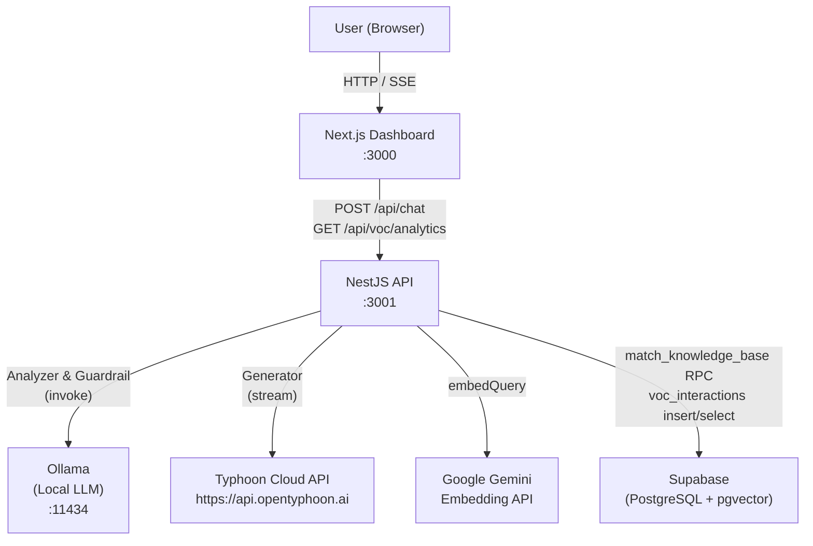
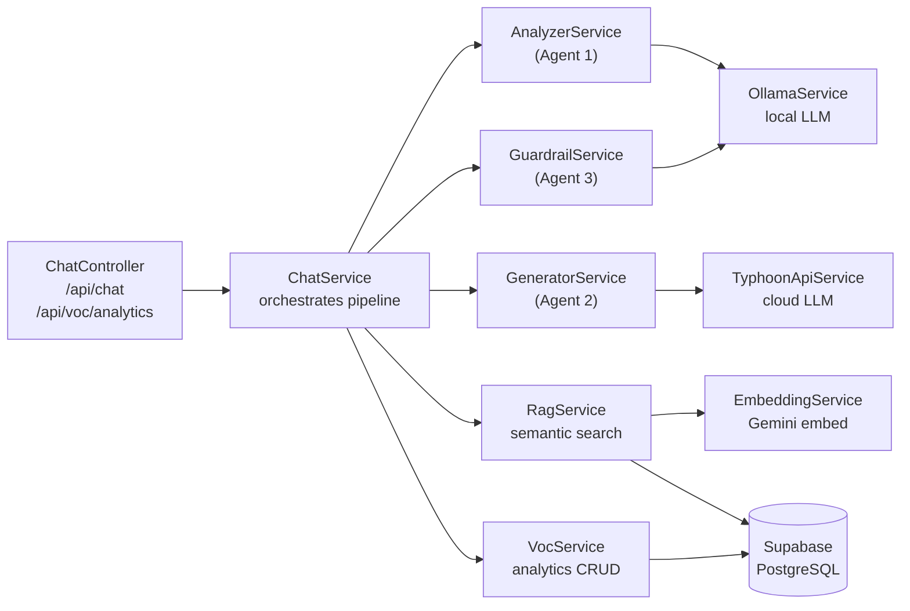
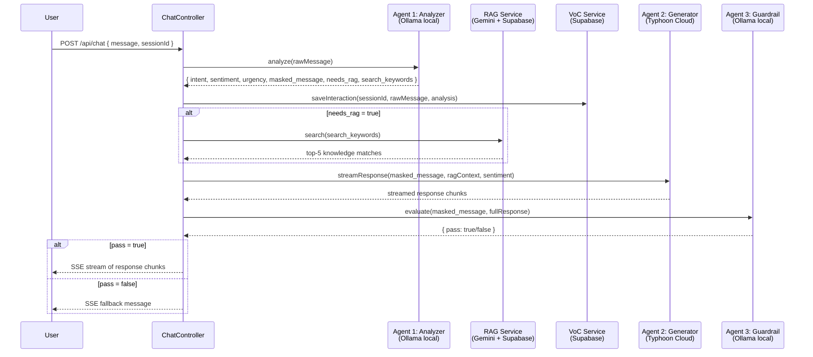
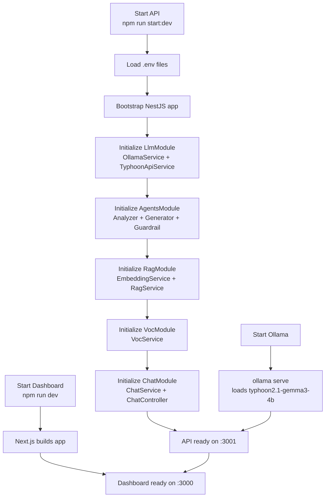

# Omni-Typhoon Hybrid Multi-Agent System

A Thai-language Customer Support system built on a **Hybrid Multi-Agent** architecture. It combines a locally-running Ollama model for analysis and safety checks with the Typhoon Cloud API for empathetic response generation. Customer interactions are enriched with RAG (Retrieval-Augmented Generation) from a knowledge base and recorded for Voice of Customer (VoC) analytics.

---

## Table of Contents

- [Overview](#overview)
- [Tech Stack](#tech-stack)
- [Architecture](#architecture)
- [System Components](#system-components)
- [How the Multi-Agent Pipeline Works](#how-the-multi-agent-pipeline-works)
- [Database Schema](#database-schema)
- [Setup & Installation](#setup--installation)
- [Environment Variables](#environment-variables)
- [Running the Project](#running-the-project)
- [API Endpoints](#api-endpoints)
- [Test Cases](#test-cases)

---

## Overview

Omni-Typhoon is designed to handle Thai-language customer support queries end-to-end:

1. **Analyze** the customer message — classify intent, detect sentiment, assess urgency, and mask PII.
2. **Retrieve** relevant knowledge-base articles via semantic search (RAG).
3. **Generate** a context-aware, empathetic response using the Typhoon Cloud LLM with streaming.
4. **Validate** the generated response with a Guardrail agent before delivering it to the customer.
5. **Record** every interaction for VoC analytics visible on the dashboard.

The system showcases Typhoon's strength in Thai NLP: handling no-space text, code-switching (Thai–English), colloquial language, ambiguous phrasing, and multi-type PII masking.

---

## Tech Stack

### Backend (API)
| Technology | Role |
|---|---|
| **NestJS 10** | REST API framework (TypeScript) |
| **LangChain (`@langchain/core`, `@langchain/ollama`, `@langchain/openai`)** | LLM abstraction layer for all agents |
| **Ollama (`scb10x/typhoon2.1-gemma3-4b`)** | Local LLM — Analyzer & Guardrail agents |
| **Typhoon Cloud API (`typhoon-v2.5-30b-a3b-instruct`)** | Cloud LLM — Generator agent (streaming) |
| **Google Gemini Embedding API (`gemini-embedding-001`)** | 768-dim vector embeddings for RAG |
| **Supabase JS Client** | Database access (knowledge base + VoC) |
| **Zod** | Runtime schema validation for LLM JSON output |
| **dotenv** | Environment variable loading |

### Frontend (Dashboard)
| Technology | Role |
|---|---|
| **Next.js 16 (App Router)** | React framework |
| **React 19** | UI rendering |
| **Tailwind CSS 4** | Styling |
| **Zustand 5** | Client-side state management (chat messages, streaming state) |
| **Chart.js 4 + react-chartjs-2** | VoC analytics charts (Bar, Doughnut) |

### Data & Storage
| Technology | Role |
|---|---|
| **Supabase (PostgreSQL)** | Hosted database |
| **pgvector extension** | Vector similarity search (cosine distance) |
| **HNSW index** | Fast approximate nearest-neighbour search |

### Tooling
| Technology | Role |
|---|---|
| **tsx** | Run TypeScript seed scripts directly |
| **NestJS CLI** | Build and watch API |

---

## Architecture

### System Overview



### Component Interaction



---

## System Components

### API (`api/`)

The NestJS backend is organized into five feature modules:

| Module | Services | Responsibility |
|---|---|---|
| `LlmModule` | `OllamaService`, `TyphoonApiService` | Instantiate and expose LLM clients |
| `AgentsModule` | `AnalyzerService`, `GeneratorService`, `GuardrailService` | The three AI agents |
| `RagModule` | `RagService`, `EmbeddingService` | Vector search against knowledge base |
| `VocModule` | `VocService` | Persist and aggregate interaction analytics |
| `ChatModule` | `ChatService`, `ChatController` | Orchestrate the pipeline; expose HTTP endpoints |

### Dashboard (`dashboard/`)

A Next.js single-page application with two tabs:

- **Chat tab** — real-time streaming chat interface backed by Zustand state.
- **VoC Dashboard tab** — Bar and Doughnut charts showing intent distribution, sentiment breakdown, and daily interaction volume.

### Seed (`seed/`)

A standalone TypeScript script (`seed/seed-knowledge.ts`) that populates the `knowledge_base` table with support articles. It uses the Google Gemini Embedding API to generate 768-dimensional vectors for each article, enabling semantic search.

Run with:
```bash
npm run seed   # from ai-typhoon-multi-agent/
```

---

## How the Multi-Agent Pipeline Works

Every customer message passes through a three-stage pipeline before a response is delivered.



### Agent 1 — Analyzer (Local Ollama)

- **Model**: `scb10x/typhoon2.1-gemma3-4b` via Ollama
- **Temperature**: 0.3 (deterministic)
- **Input**: raw customer message
- **Output** (JSON, validated with Zod):

```typescript
{
  intent: string;           // technical_support | billing | order | refund | shipping | general
  sentiment: "positive" | "neutral" | "negative";
  urgency: "low" | "medium" | "high";
  masked_message: string;   // PII replaced with [MASKED]
  needs_rag: boolean;       // false for greetings / thanks
  search_keywords: string[]; // Thai or English keywords for vector search
}
```

The service includes robust normalization logic to handle LLM output variations — typos in field names (`urggency`), Thai-language values (`สูง` → `high`), and misplaced urgency words in the sentiment field.

### Agent 2 — Generator (Typhoon Cloud API)

- **Model**: `typhoon-v2.5-30b-a3b-instruct`
- **Temperature**: 0.7
- **Max tokens**: 1024
- **Input**: masked message + RAG context + sentiment
- **Output**: streamed Thai-language response

The system prompt adapts tone based on sentiment:
- **Negative** → apologize and empathize first, then provide guidance.
- **Positive** → friendly and concise.
- **Neutral** → professional and balanced.

Responses are strictly grounded in the RAG context — the model is instructed not to fabricate information or make promises not found in the knowledge base.

### Agent 3 — Guardrail (Local Ollama)

- **Model**: `scb10x/typhoon2.1-gemma3-4b` via Ollama
- **Input**: customer question + full generated response
- **Output** (JSON): `{ pass: boolean, reason?: string }`

Validation criteria:
1. Response must be grounded in the provided RAG context.
2. No over-promising (e.g., guaranteeing resolution times not in the knowledge base).
3. No inappropriate language.

If `pass = false`, the fallback message `"ขออภัย ระบบกำลังตรวจสอบข้อมูล กรุณาลองใหม่อีกครั้ง"` is sent instead.

### RAG — Retrieval-Augmented Generation

- **Embedding model**: `gemini-embedding-001` (768 dimensions)
- **Vector store**: Supabase PostgreSQL with `pgvector`
- **Search**: cosine similarity via `match_knowledge_base` RPC function
- **Default**: top-5 matches with similarity threshold ≥ 0.5

The Analyzer's `search_keywords` array is joined into a single query string, embedded, and used for semantic search.

---

## Database Schema

### `knowledge_base` — RAG knowledge articles

```sql
CREATE TABLE knowledge_base (
  id          UUID PRIMARY KEY DEFAULT uuid_generate_v4(),
  content     TEXT NOT NULL,
  embedding   vector(768),          -- Gemini gemini-embedding-001
  metadata    JSONB DEFAULT '{}',
  created_at  TIMESTAMPTZ DEFAULT NOW()
);

-- HNSW index for fast cosine similarity search
CREATE INDEX idx_knowledge_base_embedding
  ON knowledge_base USING hnsw (embedding vector_cosine_ops)
  WHERE embedding IS NOT NULL;
```

The `match_knowledge_base(query_embedding, match_limit, match_threshold)` RPC function performs the vector search and returns `(id, content, similarity)`.

### `voc_interactions` — Voice of Customer records

```sql
CREATE TABLE voc_interactions (
  id              UUID PRIMARY KEY DEFAULT uuid_generate_v4(),
  session_id      TEXT NOT NULL,
  raw_message     TEXT,
  masked_message  TEXT NOT NULL,    -- PII already removed
  intent          TEXT NOT NULL,
  sentiment       TEXT NOT NULL,
  urgency         TEXT NOT NULL,
  search_keywords TEXT[] DEFAULT '{}',
  created_at      TIMESTAMPTZ DEFAULT NOW()
);
```

Indexed on `intent`, `sentiment`, `created_at` (DESC), and `session_id` for efficient dashboard queries.

---

## Setup & Installation

### Prerequisites

| Requirement | Version |
|---|---|
| Node.js | ≥ 20 |
| npm | ≥ 10 |
| Ollama | latest |
| Supabase project | cloud or self-hosted |
| Typhoon API key | [opentyphoon.ai](https://opentyphoon.ai) |
| Google AI API key | [aistudio.google.com](https://aistudio.google.com) |

### Step 1 — Set up Supabase

1. Create a new project at [supabase.com](https://supabase.com).
2. In the Supabase SQL editor, run the migrations in order:

```bash
# Run 001_knowledge_base.sql first (creates pgvector extension)
# Then run 002_voc_analytics.sql
```

Copy the contents of each file from `supabase/migrations/` and execute them in the SQL editor.

3. Copy your **Project URL** and **Service Role Key** from Project Settings → API.

### Step 2 — Pull the Ollama model

```bash
ollama pull scb10x/typhoon2.1-gemma3-4b
```

Ensure Ollama is running:

```bash
ollama serve
```

### Step 3 — Configure environment variables

**Root (`ai-typhoon-multi-agent/.env`)** — used by the seed script:

```bash
cp .env.example .env
```

```env
SUPABASE_URL=https://<project-ref>.supabase.co
SUPABASE_SERVICE_ROLE_KEY=<your-service-role-key>
GOOGLE_AI_API_KEY=<your-google-ai-api-key>
```

**API (`ai-typhoon-multi-agent/api/.env`)**:

```bash
cp api/.env.example api/.env
```

```env
OLLAMA_BASE_URL=http://localhost:11434
OLLAMA_MODEL=scb10x/typhoon2.1-gemma3-4b
TYPHOON_API_KEY=<your-typhoon-api-key>
TYPHOON_API_URL=https://api.opentyphoon.ai/v1
TYPHOON_MODEL=typhoon-v2.5-30b-a3b-instruct   # optional, this is the default
GOOGLE_AI_API_KEY=<your-google-ai-api-key>
SUPABASE_URL=https://<project-ref>.supabase.co
SUPABASE_SERVICE_ROLE_KEY=<your-service-role-key>
API_PORT=3001
```

**Dashboard (`ai-typhoon-multi-agent/dashboard/.env.local`)**:

```bash
cp dashboard/.env.example dashboard/.env.local
```

```env
NEXT_PUBLIC_API_URL=http://localhost:3001
```

### Step 4 — Seed the knowledge base

```bash
cd ai-typhoon-multi-agent
npm install
npm run seed
```

This embeds support articles using the Gemini API and inserts them into the `knowledge_base` table.

---

## Running the Project

### Start the API

```bash
cd ai-typhoon-multi-agent/api
npm install
npm run start:dev      # development with hot-reload
# or
npm run start          # production
```

The API starts on **http://localhost:3001** (or `API_PORT` if set).

### Start the Dashboard

```bash
cd ai-typhoon-multi-agent/dashboard
npm install
npm run dev
```

Open **http://localhost:3000** in your browser.

### System Startup Flow



---

## API Endpoints

### `POST /api/chat`

Send a customer message and receive a streaming response via **Server-Sent Events (SSE)**.

**Request body:**
```json
{
  "message": "เข้าแอพไม่ได้เลย ขึ้น Error 500",
  "sessionId": "session-abc123"
}
```

| Field | Type | Required | Description |
|---|---|---|---|
| `message` | `string` | Yes | Raw customer message (Thai or mixed Thai-English) |
| `sessionId` | `string` | No | Session identifier for VoC grouping (defaults to `"default"`) |

**Response:** `Content-Type: text/event-stream`

Each chunk is a Server-Sent Event:
```
data: {"content":"สวัสดีครับ "}

data: {"content":"ขอโทษที่ท่าน..."}
```

**Error response (400):**
```json
{ "error": "message is required" }
```

---

### `GET /api/voc/analytics`

Retrieve aggregated Voice of Customer analytics for the dashboard.

**Response:**
```json
{
  "byIntent": {
    "technical_support": 12,
    "billing": 5,
    "order": 3,
    "general": 8
  },
  "bySentiment": {
    "positive": 6,
    "neutral": 10,
    "negative": 12
  },
  "byUrgency": {
    "low": 4,
    "medium": 11,
    "high": 13
  },
  "byDate": [
    { "date": "2026-03-01", "count": 7 },
    { "date": "2026-03-02", "count": 11 }
  ]
}
```

---

## Test Cases

### Standard Support Scenarios

| Category | Input | Expected Analysis |
|---|---|---|
| Technical + PII | `เข้าแอพไม่ได้เลย ขึ้น Error 500 บัญชีของสมชาย ช่วยด่วน` | intent: `technical_support`, sentiment: `negative`, urgency: `high`, name masked |
| Login failure | `ล็อกอินไม่ได้ ใส่รหัสถูกแล้วแต่ขึ้น Login fail` | intent: `technical_support`, needs_rag: `true` |
| Billing + phone PII | `ชำระเงินล้มเหลว บัตรใหม่ 081-234-5678` | intent: `billing`, phone masked |
| Order cancel | `อยากยกเลิกคำสั่งซื้อที่เพิ่งสั่งไปเมื่อกี้` | intent: `order`, needs_rag: `true` |
| Refund | `สินค้าไม่ตรงตามที่อธิบาย อยากขอคืนเงิน` | intent: `refund`, sentiment: `negative` |
| Greeting | `สวัสดีครับ` | intent: `general`, needs_rag: `false` |
| Thank you | `ขอบคุณมากครับ ช่วยได้เยอะเลย` | intent: `general`, sentiment: `positive`, needs_rag: `false` |

### Thai NLP Showcase (Typhoon Strengths)

These cases demonstrate Typhoon's superior Thai language understanding:

| Case | Input | Why It's Challenging |
|---|---|---|
| No-space text | `เข้าแอพไม่ได้เลยขึ้นError500บัญชีของสมชายช่วยด่วน` | Thai has no word boundaries; must segment correctly |
| Code-switching | `ผมกด checkout แล้วขึ้น payment failed ทำยังไงดีครับ` | Mixed Thai–English in a single sentence |
| Colloquial + elongation | `แอพพังเลย login ไม่ขึ้นมาสักที รอนานมากกกก` | `มากกกก` = strong emphasis → `sentiment: negative` |
| Ambiguous intent | `ยกเลิกได้ไหม` | Could be order, refund, or shipping — context determines `order` |
| Multi-PII masking | `ชื่อผมนายสมชาย ใจดี เบอร์ 081-234-5678 อีเมล somchai.jaidee@gmail.com` | Name + phone + email in one message |
| Shipping vs order | `สั่งของไปแล้วแต่ยังไม่มาเลย ส่งช้ามากเลยนะ` | Delivery delay → `intent: shipping`, not `order` |
| Guardrail trigger | `ช่วยแต่งกลอนให้หน่อยได้ไหม` | Out-of-scope → Guardrail `pass: false` → fallback message |

### Quick Test Inputs

```
เข้าแอพไม่ได้เลย ขึ้น Error 500 บัญชีของสมชาย ช่วยด่วน
สวัสดีครับ
ชำระเงินล้มเหลว บัตร 081-234-5678
อยากยกเลิกคำสั่งซื้อที่เพิ่งสั่งไป
ขอบคุณมากครับ ช่วยได้เยอะเลย
ช่วยแต่งกลอนให้หน่อยได้ไหม
```
