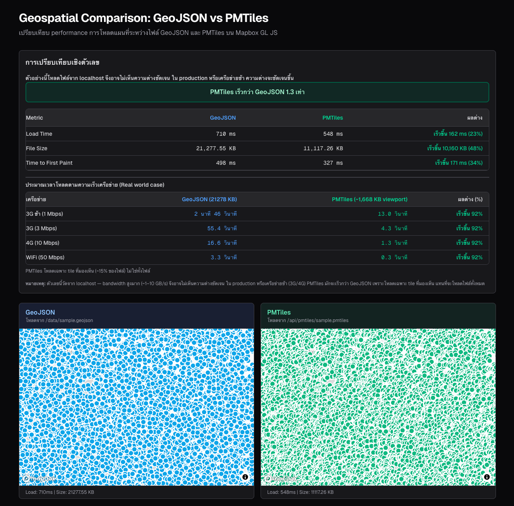
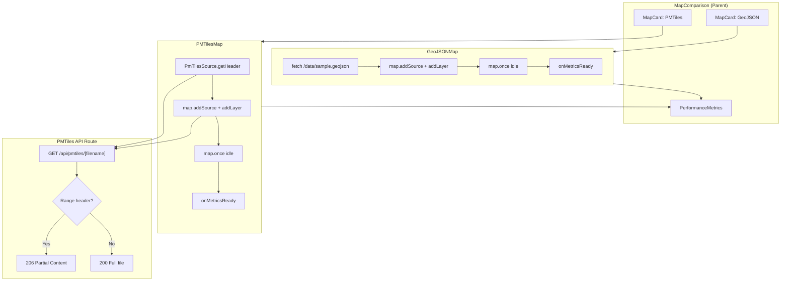
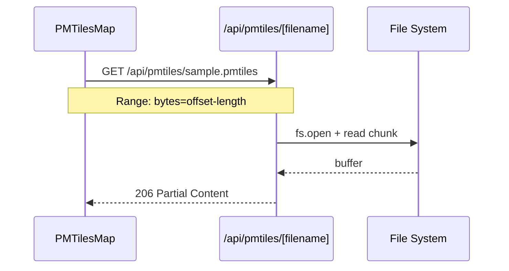

# Geospatial Comparison: GeoJSON vs PMTiles

เปรียบเทียบ performance การโหลดแผนที่ระหว่างไฟล์ GeoJSON และ PMTiles บน Mapbox GL JS แบบ side-by-side พร้อม responsive design และการแสดงผลเชิงตัวเลข

## Table of Contents

- [ภาพรวมระบบ](#ภาพรวมระบบ)
- [Screenshots](#screenshots)
- [Getting Started](#getting-started)
- [Tech Stack](#tech-stack)
- [สถาปัตยกรรมและ Data Flow](#สถาปัตยกรรมและ-data-flow)
- [Key Features](#key-features)
- [โครงสร้างข้อมูล](#โครงสร้างข้อมูล)

---

## ภาพรวมระบบ

แอปนี้เปรียบเทียบ **การโหลดแผนที่ GeoJSON กับ PMTiles** บน Mapbox GL JS แบบ side-by-side โดย:

- **GeoJSON** — โหลดจาก static file (`/data/sample.geojson`) แบบเต็มไฟล์
- **PMTiles** — โหลดผ่าน API route (`/api/pmtiles/sample.pmtiles`) รองรับ HTTP Range requests เพื่อดึงเฉพาะ tile ที่มองเห็น

แสดง **Performance Metrics** (Load Time, File Size, Time to First Paint) และ **Network Simulation** (ประมาณเวลาโหลดตาม 3G/4G/WiFi) เพื่อให้เห็นความต่างในสภาพแวดล้อมจริง

---

## Screenshots

ผลลัพธ์จากการเปรียบเทียบระหว่าง PMTiles และ GeoJSON:



**หมายเหตุ:** ตัวเลขนี้วัดจาก localhost — bandwidth สูงมาก (~1–10 GB/s) จึงอาจไม่เห็นความต่างชัดเจน ใน production หรือเครือข่ายช้า (3G/4G) PMTiles มักจะเร็วกว่า GeoJSON เพราะโหลดเฉพาะ tile ที่มองเห็น แทนที่จะโหลดไฟล์ทั้งหมด

---

## Getting Started

### Prerequisites

- Node.js 18+
- npm หรือ yarn

### Installation

1. **ติดตั้ง dependencies**

```bash
npm install
```

(postinstall จะแก้ไข type stub สำหรับ `@types/mapbox__point-geometry` อัตโนมัติ)

2. **ตั้งค่า Mapbox Access Token**

สร้างไฟล์ `.env.local` และเพิ่ม token:

```bash
cp .env.example .env.local
```

แก้ไข `.env.local` และใส่ Mapbox token ของคุณ (สมัครได้ที่ [mapbox.com](https://account.mapbox.com/)):

```
NEXT_PUBLIC_MAPBOX_ACCESS_TOKEN=pk.your_actual_token_here
```

3. **รัน development server**

```bash
npm run dev
```

เปิด [http://localhost:3000](http://localhost:3000)

---

## Tech Stack

| ประเภท | เทคโนโลยี |
|--------|-----------|
| **Map** | Mapbox GL JS |
| **PMTiles** | mapbox-pmtiles |
| **Framework** | Next.js 16, React 19 |
| **Styling** | Tailwind CSS 4 |
| **Runtime** | Node.js |

---

## สถาปัตยกรรมและ Data Flow

### โครงสร้าง Component

```
MapComparison (parent)
├── PerformanceMetrics (geojsonMetrics, pmtilesMetrics)
└── MapCard × 2
    ├── GeoJSONMap → onMetricsReady → setGeojsonMetrics
    └── PMTilesMap → onMetricsReady → setPmtilesMetrics
```

### Flow Diagram



### Request Flow: PMTiles API



### Metrics ที่แต่ละ Map รายงาน

| Metric | คำอธิบาย |
|--------|----------|
| `loadTimeMs` | เวลาตั้งแต่เริ่มโหลดจน map idle |
| `fileSizeKb` | ขนาดไฟล์ (KB) |
| `timeToFirstPaintMs` | เวลาจนถึง first paint |

---

## Key Features

### 1. PMTiles API (HTTP Range Support)

- **Endpoint**: `GET /api/pmtiles/[filename]`
- **ตัวอย่าง**: `/api/pmtiles/sample.pmtiles`
- รองรับ `Range: bytes=offset-length` สำหรับการโหลดแบบ streaming
- ส่งคืน `206 Partial Content` เมื่อมี Range header, `200` เมื่อโหลดเต็มไฟล์

### 2. Performance Metrics Table

- Load Time, File Size, Time to First Paint
- แสดงผลต่างระหว่าง GeoJSON vs PMTiles
- สรุปว่า PMTiles เร็วกว่า/ช้ากว่า GeoJSON กี่เท่า

### 3. Network Simulation (3G/4G/WiFi)

- ประมาณเวลาโหลดตามความเร็วเครือข่าย:
  - 3G ช้า (1 Mbps)
  - 3G (3 Mbps)
  - 4G (10 Mbps)
  - WiFi (50 Mbps)
- PMTiles ใช้ ~15% ของไฟล์ (viewport) ในการคำนวณ

---

## โครงสร้างข้อมูล

ไฟล์ GeoJSON และ PMTiles เก็บไว้ที่ `public/data/`:

| ไฟล์ | คำอธิบาย |
|------|----------|
| `sample.geojson` | ข้อมูลจุดตัวอย่างในประเทศไทย |
| `sample.pmtiles` | ข้อมูลเดียวกันแปลงเป็น PMTiles |
