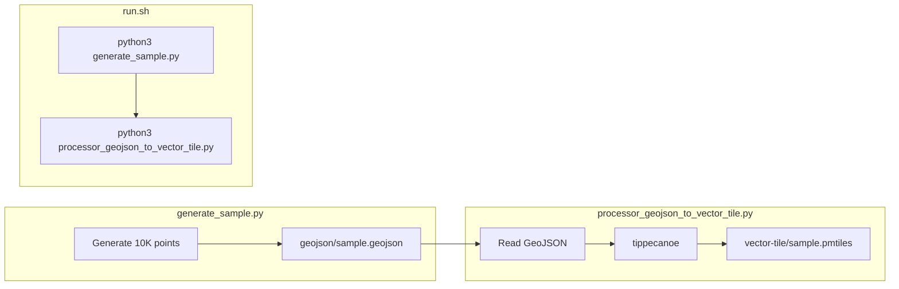

# Geospatial Data Pipeline

Pipeline สำหรับสร้างข้อมูลอสังหาริมทรัพย์จำลองและแปลงเป็นรูปแบบ PMTiles สำหรับใช้แสดงบนแผนที่แบบเวกเตอร์

## จุดประสงค์ (Purpose)

Pipeline นี้มีไว้เพื่อ:

1. **สร้างข้อมูลจำลองสำหรับทดสอบ** — สร้างข้อมูลอสังหาริมทรัพย์ 10,000 จุดกระจายทั่วประเทศไทย (ประเภท condo, townhouse, detached house, land) พร้อม attributes เช่น ราคา, จำนวนห้อง, พื้นที่

2. **แปลงเป็น PMTiles** — แปลง GeoJSON เป็น PMTiles format เพื่อให้สามารถโหลดบนแผนที่แบบเวกเตอร์ได้อย่างมีประสิทธิภาพ โดย PMTiles จะ:
   - โหลดเฉพาะ tile ที่ต้องการตามระดับ zoom
   - ลดขนาดข้อมูลที่โหลดเมื่อเทียบกับ GeoJSON ทั้งไฟล์
   - รองรับการแสดงผลแบบ real-time บนแผนที่

3. **ใช้สำหรับเปรียบเทียบประสิทธิภาพ** — ใช้ร่วมกับ geospatial-comparison เพื่อเปรียบเทียบการแสดงผลระหว่าง GeoJSON vs PMTiles ในแง่ของ performance, load time และ UX

## Flow การทำงาน



### ขั้นตอน

| ขั้นตอน | Script | Input | Output |
|---------|--------|-------|--------|
| 1 | `generate_sample.py` | - | `geojson/sample.geojson` |
| 2 | `processor_geojson_to_vector_tile.py` | `geojson/sample.geojson` | `vector-tile/sample.pmtiles` |

### รายละเอียด

1. **generate_sample.py** — สุ่มพิกัดทั่วประเทศไทย สร้าง attributes ตามประเภทอสังหาฯ แปลงเป็น GeoDataFrame และบันทึกเป็น GeoJSON

2. **processor_geojson_to_vector_tile.py** — ใช้ tippecanoe แปลง GeoJSON เป็น PMTiles พร้อม clustering (รวมจุดใกล้กัน) เพื่อการแสดงผลที่เหมาะสมในแต่ละระดับ zoom

## การใช้งาน

### Prerequisites

- **Python 3** พร้อม geopandas, pandas, numpy, pyarrow
- **tippecanoe** ติดตั้งในระบบ (เช่น `brew install tippecanoe` บน macOS)

### ติดตั้ง Dependencies

บน macOS ที่ใช้ Homebrew Python แนะนำให้ใช้ virtual environment:

```bash
cd geospatial-data-pipeline

# สร้าง virtual environment
python3 -m venv .venv

# เปิดใช้งาน venv และติดตั้ง dependencies
source .venv/bin/activate
pip install -r requirements.txt
```

`run.sh` จะใช้ Python จาก `.venv` อัตโนมัติถ้ามีโฟลเดอร์ `.venv`

### รัน pipeline ทั้งหมด

```bash
./run.sh
```

หรือรันทีละขั้นตอน:

```bash
# Step 1: สร้าง GeoJSON
python3 generate_sample.py

# Step 2: แปลงเป็น PMTiles
python3 processor_geojson_to_vector_tile.py
```

### รันด้วย arguments

```bash
# ระบุ path GeoJSON และ output PMTiles
python3 processor_geojson_to_vector_tile.py /path/to/input.geojson -o /path/to/output.pmtiles
```

## โครงสร้างโฟลเดอร์

```
geospatial-data-pipeline/
├── generate_sample.py      # สร้างข้อมูลจำลอง
├── processor_geojson_to_vector_tile.py  # แปลง GeoJSON → PMTiles
├── requirements.txt
├── run.sh                  # script สำหรับรัน pipeline ทั้งหมด
├── README.md
├── geojson/
│   └── sample.geojson      # output จาก generate
└── vector-tile/
    └── sample.pmtiles      # output จาก processor
```
