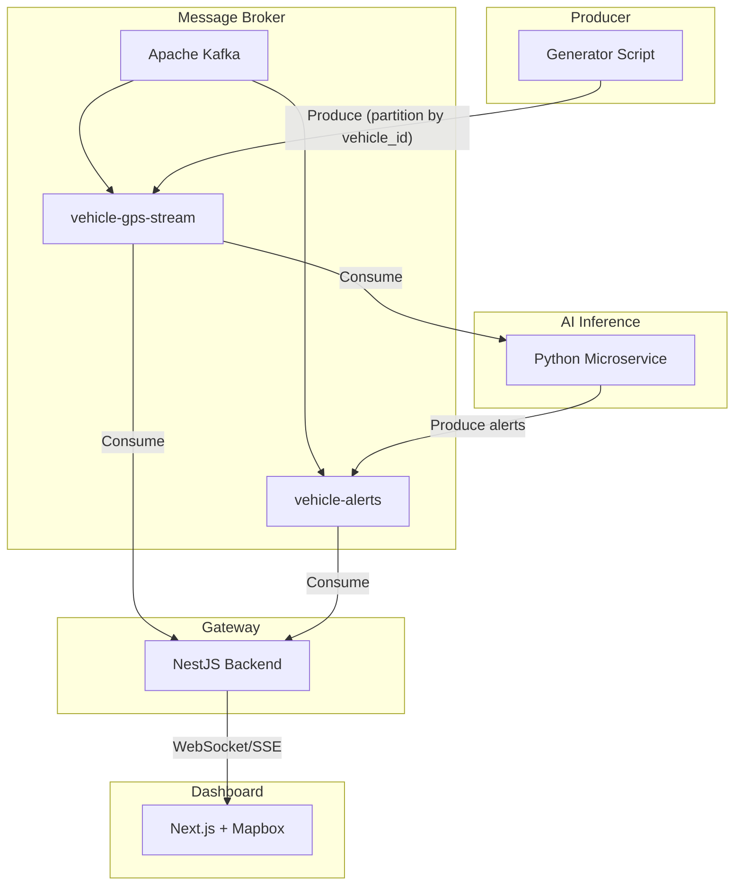
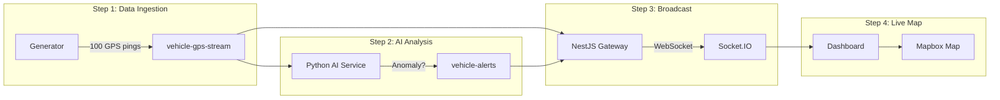

# Geo-Stream: Real-time Anomaly Detection

ระบบตรวจจับความผิดปกติของพิกัด GPS รถบรรทุกแบบ Real-time ด้วย Event-Driven Architecture

## ภาพรวมระบบ

จินตนาการว่ามีรถบรรทุก 100 คัน ส่งพิกัด GPS เข้ามาทุกวินาที — ระบบนี้รับมือได้ทันที วิเคราะห์ด้วย AI (Isolation Forest + rule-based) เพื่อตรวจจับ:

- **Spatial Anomaly** — พิกัดกระโดดข้ามอำเภอใน 1 วินาที (GPS Spoofing / สัญญาณเพี้ยน)
- **Speed Anomaly** — ขับเกิน 120 กม./ชม. ในเขตเมือง
- **Idling Anomaly** — จอดแช่นานเกิน 30 นาที ทั้งที่เครื่องยนต์ติด (อาจเกิดอุบัติเหตุ)

## Architecture Overview



## Flow การทำงาน: การเดินทางของข้อมูลใน 1 วินาที

จาก 100 requests/sec — นี่คือสิ่งที่เกิดขึ้นหลังบ้าน:



### Step 1: Data Ingestion (รับข้อมูลเข้า)

Generator สร้าง JSON เช่น `{ vehicle_id: "TRK-001", lat: 13.75, lng: 100.51, speed: 60, timestamp: ... }` แล้วยิงเข้า Kafka Topic `vehicle-gps-stream` — **จุดสำคัญ:** Partition ตาม `vehicle_id` เพื่อให้พิกัดของรถคันเดียวกันเรียงลำดับถูกต้อง (ถ้าไม่ทำ รถอาจวิ่งถอยหลังในระบบได้)

### Step 2: Real-time AI Analysis (วิเคราะห์ความผิดปกติ)

Python Service ดูดข้อมูลจาก `vehicle-gps-stream` แบบ Real-time เก็บประวัติพิกัด **10 จุดล่าสุด** ของแต่ละคัน (Sliding Window) แล้วส่งเข้า ML Model (Isolation Forest) + rule-based (speed, idling) — ถ้าพบ anomaly จะพ่น Event ไปที่ Topic `vehicle-alerts` ทันที

### Step 3: Broadcast & Routing (กระจายสู่หน้าจอ)

NestJS Subscribe ทั้ง `vehicle-gps-stream` และ `vehicle-alerts` แปลง Kafka Messages เป็น WebSocket (Socket.IO) ส่งตรงไปที่เบราว์เซอร์

### Step 4: Live Visualization (แสดงผลบนแผนที่)

Next.js + Mapbox รับข้อมูลผ่าน WebSocket — พิกัดใหม่มาถึง หมุดรถขยับลื่นไหล; มี Alert เข้ามา หมุดเปลี่ยนเป็นสีแดงกระพริบ + Notification เตือน Operator

> **สรุป:** ข้อมูลไหลจาก Generator → Kafka → AI (ตรวจจับ) → Kafka (alerts) → NestJS → WebSocket → Dashboard แผนที่อัปเดตแบบ Real-time ทุกวินาที

## Tech Stack

| Component | Tech |
|-----------|------|
| Generator | Python, confluent-kafka |
| Message Broker | Apache Kafka |
| AI Inference | Python, scikit-learn |
| Gateway | NestJS, Kafka, WebSocket |
| Dashboard | Next.js 16, React 19, Mapbox GL JS |

## Prerequisites

- Docker & Docker Compose
- Node.js 18+
- Python 3.10+
- Mapbox Access Token ([mapbox.com](https://account.mapbox.com/))
- **macOS:** `brew install librdkafka` (สำหรับ confluent-kafka)

## การเริ่มต้นระบบ (หลัง Clone)

### 1. Start Kafka

```bash
cd geospatial-realtime-anomaly-detection
docker-compose up -d
```

รอ ~30 วินาทีให้ Kafka พร้อมใช้งาน

### 2. Gateway (NestJS)

```bash
cd gateway
npm install
npm run start:dev
```

Gateway จะรันที่ `http://localhost:3001` (WebSocket ใช้ Socket.IO บน port เดียวกัน)

### 3. AI Service (Python)

```bash
cd ai-service
./run.sh
```

> **macOS:** (1) ถ้า `pip3 install` ขึ้น error `externally-managed-environment` ให้ใช้ `./run.sh` แทน  
> (2) ต้องติดตั้ง `brew install librdkafka` ก่อน (สำหรับ confluent-kafka)  
> (3) ถ้าเคยใช้ kafka-python มาก่อน ให้ลบ `rm -rf .venv` แล้วรัน `./run.sh` ใหม่

หรือติดตั้งเอง (ต้อง activate venv ก่อน pip3):
```bash
python3 -m venv .venv
source .venv/bin/activate   # Windows: .venv\Scripts\activate
pip3 install -r requirements.txt
python3 main.py
```

### 4. Dashboard (Next.js)

```bash
cd dashboard
cp .env.example .env.local
# แก้ไข .env.local ใส่ NEXT_PUBLIC_MAPBOX_ACCESS_TOKEN
npm install
npm run dev
```

เปิด [http://localhost:3000](http://localhost:3000)

### 5. Generator (Mock Data)

```bash
cd generator
./run.sh
```

> **macOS:** ต้องติดตั้ง `brew install librdkafka` ก่อน ถ้าเคยใช้ kafka-python ให้ลบ `.venv` แล้วรัน `./run.sh` ใหม่

หรือติดตั้งเอง (ต้อง activate venv ก่อน pip3):
```bash
python3 -m venv .venv
source .venv/bin/activate
pip3 install -r requirements.txt
python3 main.py
```

Generator จะส่ง GPS pings 100 คันทุก 1 วินาที

## ลำดับการรันที่แนะนำ

1. `docker-compose up -d`
2. `gateway` (NestJS)
3. `ai-service` (Python)
4. `dashboard` (Next.js)
5. `generator` (Python)

## Environment Variables

| Variable | Component | Description |
|----------|-----------|-------------|
| `KAFKA_BROKERS` | Generator, AI, Gateway | Default: `localhost:9092` |
| `NEXT_PUBLIC_MAPBOX_ACCESS_TOKEN` | Dashboard | Mapbox token |
| `NEXT_PUBLIC_WS_URL` | Dashboard | WebSocket URL (default: `ws://localhost:3001`) |
