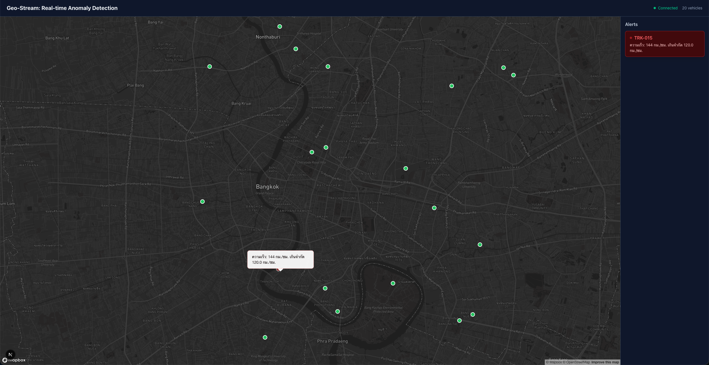
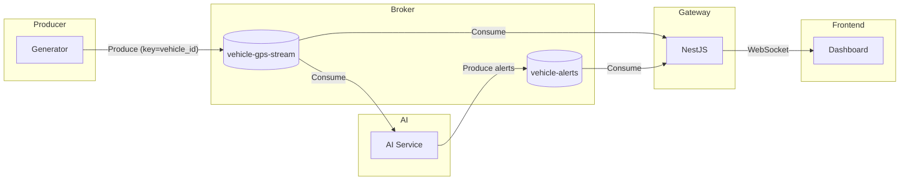
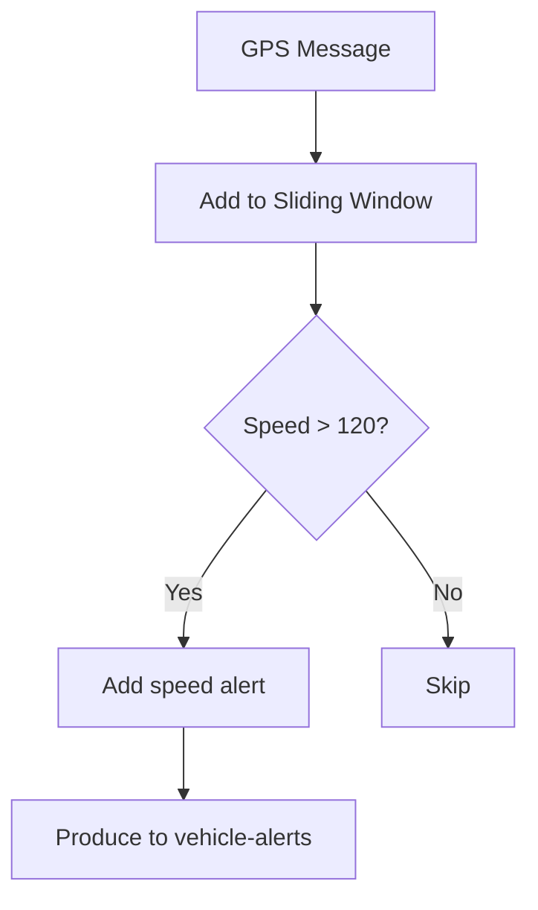
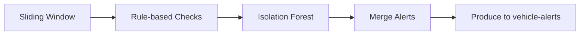
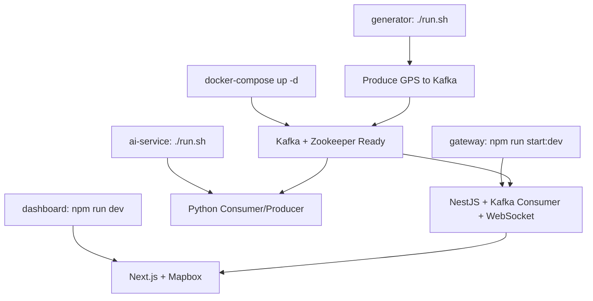
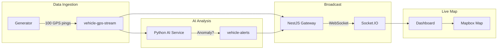

# Geo-Stream: Real-time Anomaly Detection

ระบบตรวจจับความผิดปกติของพิกัด GPS รถบรรทุกแบบ Real-time ด้วย Event-Driven Architecture

## Table of Contents

- [Screenshots](#screenshots)
- [Getting Started](#getting-started)
- [Tech Stack](#tech-stack)
- [Overall System Operation](#overall-system-operation)
- [Detection Conditions](#detection-conditions)
- [Speed Handling](#speed-handling)
- [Isolation Forest](#isolation-forest)
- [Architecture & Data Flow](#architecture--data-flow)
- [Project Structure](#project-structure)
- [Environment Variables](#environment-variables)

---

## Screenshots

| คำอธิบาย | ภาพ |
|----------|-----|
| การตรวจจับความผิดปกติแบบ realtime โดยใช้ rule-based checks หากความเร็วเกินกำหนดให้ทำการ alert |  |

---

## Getting Started

### Prerequisites

- Docker & Docker Compose
- Node.js 18+
- Python 3.10+
- Mapbox Access Token ([mapbox.com](https://account.mapbox.com/))
- **macOS:** `brew install librdkafka` (สำหรับ confluent-kafka)

### Installation & Run

#### 1. Start Kafka

```bash
cd geospatial-realtime-anomaly-detection
docker-compose up -d
```

รอ ~30 วินาทีให้ Kafka พร้อมใช้งาน

#### 2. Gateway (NestJS)

```bash
cd gateway
npm install
npm run start:dev
```

Gateway จะรันที่ `http://localhost:3001` (WebSocket ใช้ Socket.IO บน port เดียวกัน)

#### 3. AI Service (Python)

```bash
cd ai-service
./run.sh
```

> **macOS:** (1) ถ้า `pip3 install` ขึ้น error `externally-managed-environment` ให้ใช้ `./run.sh` แทน  
> (2) ต้องติดตั้ง `brew install librdkafka` ก่อน (สำหรับ confluent-kafka)  
> (3) ถ้าเคยใช้ kafka-python มาก่อน ให้ลบ `rm -rf .venv` แล้วรัน `./run.sh` ใหม่

หรือติดตั้งเอง (ต้อง activate venv ก่อน pip3):

```bash
python3 -m venv .venv
source .venv/bin/activate   # Windows: .venv\Scripts\activate
pip3 install -r requirements.txt
python3 main.py
```

#### 4. Dashboard (Next.js)

```bash
cd dashboard
cp .env.example .env.local
# แก้ไข .env.local ใส่ NEXT_PUBLIC_MAPBOX_ACCESS_TOKEN
npm install
npm run dev
```

เปิด [http://localhost:3000](http://localhost:3000)

#### 5. Generator (Mock Data)

```bash
cd generator
./run.sh
```

> **macOS:** ต้องติดตั้ง `brew install librdkafka` ก่อน ถ้าเคยใช้ kafka-python ให้ลบ `.venv` แล้วรัน `./run.sh` ใหม่

หรือติดตั้งเอง:

```bash
python3 -m venv .venv
source .venv/bin/activate
pip3 install -r requirements.txt
python3 main.py
```

Generator จะส่ง GPS pings ทุก `INTERVAL_SEC` วินาที (default: 3 วินาที)

### Recommended Startup Order

1. `docker-compose up -d`
2. `gateway` (NestJS)
3. `ai-service` (Python)
4. `dashboard` (Next.js)
5. `generator` (Python)

---

## Tech Stack

| Layer | Technology |
|-------|------------|
| **Frontend** | Next.js 16, React 19, Mapbox GL JS, Socket.IO Client |
| **Backend / Gateway** | NestJS, KafkaJS, Socket.IO |
| **AI Inference** | Python 3.10+, scikit-learn, confluent-kafka |
| **Data / Message Broker** | Apache Kafka, Zookeeper |
| **Generator** | Python, confluent-kafka |
| **DevOps / Tools** | Docker Compose, npm, pip |

---

## Overall System Operation

### End-to-End Pipeline

ข้อมูลไหลจาก **Generator → Kafka → AI Service → Kafka (alerts) → Gateway → WebSocket → Dashboard** แบบ Real-time


```mermaid
flowchart LR
    subgraph Producer
        Gen[Generator]
    end
    subgraph Broker
        K1[(vehicle-gps-stream)]
        K2[(vehicle-alerts)]
    end
    subgraph AI
        Py[AI Service]
    end
    subgraph Gateway
        Nest[NestJS]
    end
    subgraph Frontend
        Next[Dashboard]
    end

    Gen -->|"Produce (key=vehicle_id)"| K1
    K1 -->|"Consume"| Py
    Py -->|"Produce alerts"| K2
    K1 -->|"Consume"| Nest
    K2 -->|"Consume"| Nest
    Nest -->|"WebSocket"| Next
```

### Step-by-Step Flow

| Step | Component | Action |
|------|-----------|--------|
| 1 | **Generator** | สร้าง JSON `{ vehicle_id, lat, lng, speed, timestamp }` แล้ว produce เข้า Kafka topic `vehicle-gps-stream` โดยใช้ `vehicle_id` เป็น partition key |
| 2 | **Kafka** | เก็บ messages ใน `vehicle-gps-stream` และ `vehicle-alerts` |
| 3 | **AI Service** | Consume จาก `vehicle-gps-stream` → วิเคราะห์ด้วย rule-based detector → ถ้าพบ anomaly → produce เข้า `vehicle-alerts` |
| 4 | **Gateway** | Consume ทั้ง `vehicle-gps-stream` และ `vehicle-alerts` → แปลงเป็น WebSocket events (`gps:update`, `alert:new`) |
| 5 | **Dashboard** | รับ WebSocket → อัปเดตแผนที่ Mapbox แบบ Real-time และแสดง alerts |

---

## Detection Conditions

ระบบใช้ **rule-based detection** ใน `AnomalyDetector` โดยเก็บประวัติพิกัด **sliding window 10 จุดล่าสุด** ของแต่ละรถ

### Speed Anomaly (ความเร็วเกิน)

- **เงื่อนไข:** `speed > SPEED_LIMIT_KMH` (default: 120 km/h)
- **ความหมาย:** ขับเกิน 120 กม./ชม. ในเขตเมือง
- **การทำงาน:** ถ้าพบความเร็วเกิน → สร้าง alert → produce ไปที่ `vehicle-alerts` → แสดงบน Dashboard

### Detection Logic Flow


```mermaid
flowchart TD
    A[GPS Message] --> B[Add to Sliding Window]
    B --> C{Speed > 120?}
    C -->|Yes| D[Add speed alert]
    D --> E[Produce to vehicle-alerts]
    C -->|No| F[Skip]
```

---

## Speed Handling

### 1. Measurement & Source

- **Generator:** สร้างค่า `speed` แบบจำลอง:
  - ปกติ: 0–80 km/h (random delta ±5)
  - Demo anomaly: 1% โอกาส inject ความเร็ว 125–150 km/h
- **AI Service:** ใช้ค่า `speed` จาก Kafka message โดยตรง (ไม่คำนวณจากพิกัด)

### 2. Thresholds

| Config | Default | Description |
|--------|---------|-------------|
| `SPEED_LIMIT_KMH` | 120 | ความเร็วสูงสุดที่อนุญาต (km/h) |
| `SPEED_ANOMALY_MIN` | 125 | ความเร็วต่ำสุดสำหรับ demo anomaly (generator) |
| `SPEED_ANOMALY_MAX` | 150 | ความเร็วสูงสุดสำหรับ demo anomaly (generator) |

### 3. Anomaly Logic

- เปรียบเทียบ `speed` กับ `SPEED_LIMIT_KMH`
- ถ้าเกิน → สร้าง alert string: `speed: {speed} km/h exceeds {limit} km/h`
- Alert นี้ถูกส่งไปยัง `vehicle-alerts` และแสดงบน Dashboard

---

## Isolation Forest

### Current State

- **Isolation Forest ไม่ถูกเรียกใช้ในโค้ดปัจจุบัน**  
- `anomaly_detector.py` ใช้เฉพาะ rule-based checks (speed)  
- `main.py` กรอง alert `"ml: isolation forest outlier"` ออก (ป้องกันกรณีมีการเปิดใช้ในอนาคต)  
- `scikit-learn` อยู่ใน `requirements.txt` เพื่อรองรับการเปิดใช้ ML ในอนาคต

### Design (เมื่อเปิดใช้)

| Aspect | Description |
|--------|-------------|
| **เมื่อรัน** | หลัง rule-based checks ใน `check_anomalies()` — ใช้ sliding window เป็น input |
| **Input** | Feature vector จาก window: `[lat, lng, speed, timestamp, ...]` หรือ derived features (distance, velocity, etc.) |
| **Algorithm** | Isolation Forest — สร้าง trees แบบสุ่ม แยกจุด anomaly ออกได้เร็วเพราะ path สั้น |
| **Output** | `anomaly_score` หรือ binary label → ถ้า outlier → เพิ่ม `"ml: isolation forest outlier"` ใน `alerts` |
| **การเชื่อมต่อ** | อยู่ใน pipeline เดียวกับ rule-based — ผลรวมของ alerts ถูก produce ไปที่ `vehicle-alerts` |

### Integration Flow (เมื่อเปิดใช้)


```mermaid
flowchart LR
    A[Sliding Window] --> B[Rule-based Checks]
    B --> C[Isolation Forest]
    C --> D[Merge Alerts]
    D --> E[Produce to vehicle-alerts]
```

---

## Architecture & Data Flow

### System Startup Flow


```mermaid
flowchart TD
    A[docker-compose up -d] --> B[Kafka + Zookeeper Ready]
    C[gateway: npm run start:dev] --> D[NestJS + Kafka Consumer + WebSocket]
    E[ai-service: ./run.sh] --> F[Python Consumer/Producer]
    G[dashboard: npm run dev] --> H[Next.js + Mapbox]
    I[generator: ./run.sh] --> J[Produce GPS to Kafka]

    B --> D
    B --> F
    D --> H
    J --> B
```

### Data Pipeline Flow


```mermaid
flowchart LR
    subgraph S1 [Data Ingestion]
        Gen[Generator] -->|"100 GPS pings"| K1[vehicle-gps-stream]
    end
    subgraph S2 [AI Analysis]
        K1 --> AI[Python AI Service]
        AI -->|"Anomaly?"| K2[vehicle-alerts]
    end
    subgraph S3 [Broadcast]
        K1 --> GW[NestJS Gateway]
        K2 --> GW
        GW -->|"WebSocket"| WS[Socket.IO]
    end
    subgraph S4 [Live Map]
        WS --> D[Dashboard]
        D --> Map[Mapbox Map]
    end
```

### WebSocket Events

| Event | Direction | Payload |
|-------|-----------|---------|
| `gps:update` | Gateway → Dashboard | `{ vehicle_id, lat, lng, speed, timestamp }` |
| `alert:new` | Gateway → Dashboard | `{ vehicle_id, lat, lng, speed, timestamp, anomaly_types[] }` |

---

## Project Structure

```
geospatial-realtime-anomaly-detection/
├── shared/              # Python config และ kafka_helpers ร่วมกัน ai-service, generator
├── ai-service/          # Python: consume GPS, detect anomalies, produce alerts
│   ├── anomaly_detector.py
│   ├── main.py
│   └── config.py
├── generator/           # Python: mock GPS producer
├── gateway/             # NestJS: Kafka → WebSocket
├── dashboard/           # Next.js + Mapbox
├── scripts/run-python.sh
└── docker-compose.yml   # Kafka + Zookeeper
```

---

## Environment Variables

| Variable | Component | Description |
|----------|-----------|-------------|
| `KAFKA_BROKERS` | Generator, AI, Gateway | Default: `localhost:9092` |
| `NEXT_PUBLIC_MAPBOX_ACCESS_TOKEN` | Dashboard | Mapbox token |
| `NEXT_PUBLIC_WS_URL` | Dashboard | WebSocket URL (default: `ws://localhost:3001`) |
| `VEHICLE_COUNT` | Generator | จำนวนรถจำลอง (default: 20) |
| `INTERVAL_SEC` | Generator | ช่วงส่ง GPS (วินาที) (default: 3.0) |
