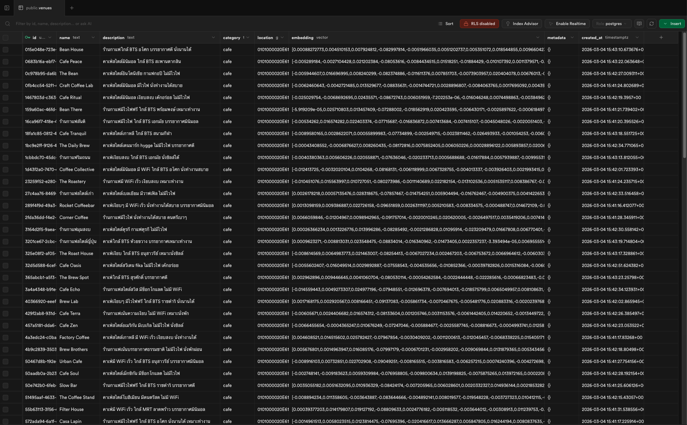
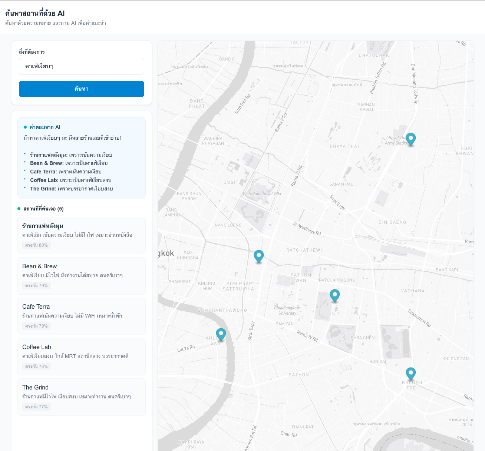
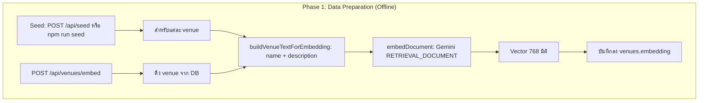
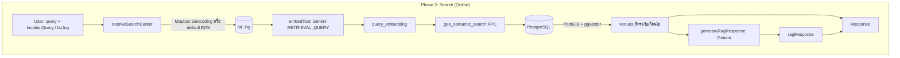
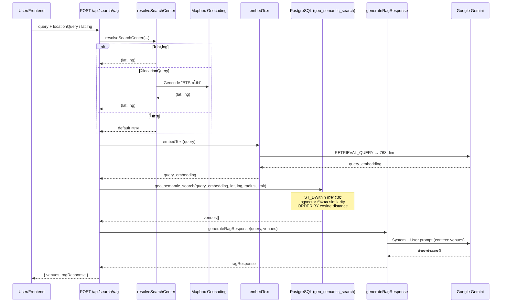

# Geospatial Search RAG

ระบบค้นหาสถานที่ด้วย **Semantic Search** และ **RAG** (Retrieval Augmented Generation) ใช้ PostgreSQL + PostGIS + pgvector บน Supabase ร่วมกับ Google Gemini และ Mapbox

## Table of Contents

- [Screenshots](#screenshots)
- [แนวคิด RAG](#แนวคิด-rag)
- [Semantic Search vs Keyword Search](#semantic-search-vs-keyword-search)
- [โครงสร้างระบบ RAG](#โครงสร้างระบบ-rag)
- [Flow Diagrams](#flow-diagrams)
- [Tech Stack](#tech-stack)
- [Setup](#setup)
- [Usage](#usage)
- [API Endpoints](#api-endpoints)

---

## Screenshots

### 1. ตัวอย่าง table เพื่อเก็บข้อมูล embedding (vector database) สำหรับการทำ RAG



### 2. ตัวอย่างการทำงาน



---

## แนวคิด RAG

**RAG (Retrieval Augmented Generation)** คือเทคนิคที่ทำให้ AI ตอบคำถามได้แม่นยำขึ้นโดยใช้ข้อมูลจริงจากฐานข้อมูล แทนการพึ่งพาความรู้ภายในของโมเดลเพียงอย่างเดียว

### ขั้นตอนหลัก 3 ขั้น

1. **Retrieve (ค้นหา)** — ค้นหาข้อมูลที่เกี่ยวข้องกับคำถามจากฐานข้อมูล (ในระบบนี้ใช้ Semantic Search + เงื่อนไขตำแหน่ง)
2. **Augment (เสริมบริบท)** — นำผลลัพธ์ที่ได้มาเป็น context เพิ่มเติมให้กับ LLM
3. **Generate (สร้างคำตอบ)** — LLM สร้างคำตอบโดยอ้างอิงจาก context ที่ให้ไปเท่านั้น

ผลลัพธ์คือคำตอบที่ **อ้างอิงได้** และ **ไม่หลุดประเด็น** เพราะจำกัดให้ AI ตอบจากข้อมูลที่มีอยู่จริงเท่านั้น

---

## Semantic Search vs Keyword Search

| | Keyword Search | Semantic Search |
|---|---|---|
| **หลักการ** | ตรงกับคำในข้อความ (exact match) | เข้าใจความหมายของข้อความ |
| **ตัวอย่าง** | ค้นหา "คาเฟ่" → เจอเฉพาะที่เขียนคำว่า "คาเฟ่" | ค้นหา "คาเฟ่เงียบๆ" → เจอ "ร้านกาแฟบรรยากาศสงบ" ได้ |
| **เทคโนโลยี** | LIKE, full-text search | Embedding + Vector similarity (cosine distance) |
| **ข้อดี** | เร็ว ใช้ทรัพยากรน้อย | ค้นหาแบบเข้าใจบริบท เหมาะกับภาษาธรรมชาติ |

ในระบบนี้ใช้ **Semantic Search** ผ่าน embedding จาก Google Gemini (768 มิติ) และ pgvector สำหรับคำนวณความคล้ายกัน (cosine similarity)

---

## โครงสร้างระบบ RAG

ระบบแบ่งเป็น 2 Phase หลัก:

### Phase 1: Data Preparation (Offline / Indexing)

- ตาราง `venues` มี: `id`, `name`, `description`, `category`, `location` (PostGIS geography), `embedding` (vector 768)
- `buildVenueTextForEmbedding`: รวม `name` + `description` เป็นข้อความสำหรับ embedding
- `embedDocument()` ใช้ Google Gemini (`gemini-embedding-001`) กับ `taskType: RETRIEVAL_DOCUMENT` → vector 768 มิติ
- บันทึก embedding ลง `venues.embedding`
- **Seed:** `POST /api/seed` หรือ `npm run seed`
- **Embed venue:** `POST /api/venues/embed` พร้อม `venueId` หรือ `venueIds`

### Phase 2: Search Flow (Online / Query)

1. User ส่ง `query` (เช่น "คาเฟ่เงียบๆ") + `locationQuery` (เช่น "BTS อโศก") หรือ `lat`/`lng`
2. `resolveSearchCenter`: แปลง location → (lat, lng) ผ่าน Mapbox Geocoding API หรือใช้ default (สยาม)
3. `embedText(query)` ใช้ `taskType: RETRIEVAL_QUERY` → `query_embedding`
4. `geoSemanticSearch`: เรียก RPC `geo_semantic_search` ใน PostgreSQL
   - **PostGIS:** `ST_DWithin` กรอง venues ในรัศมี `radius_meters`
   - **pgvector:** คำนวณ `similarity = 1 - (embedding <=> query_embedding)` (cosine distance)
   - `ORDER BY embedding <=> query_embedding`, `LIMIT match_limit`
5. `generateRagResponse`: ส่ง venues ที่ได้ + query ไป Gemini (`gemini-2.5-flash`)
   - System prompt: ผู้ช่วยแนะนำสถานที่ อ้างอิงจาก context เท่านั้น
   - User prompt: รายการสถานที่ + คำถาม
6. คืน `venues` + `ragResponse` ไป frontend

---

## Flow Diagrams

### Phase 1: Data Preparation (Indexing)



### Phase 2: Search Flow (Online Query)



### RAG Search Step-by-Step (รายละเอียด)



### Component Interaction

```mermaid
flowchart LR
    subgraph Frontend
        UI[SearchBar + Map]
    end

    subgraph API
        RAG_API[/api/search/rag]
        EMBED_API[/api/venues/embed]
        SEED_API[/api/seed]
    end

    subgraph Lib
        GEO[geocode.ts]
        EMB[embedding.ts]
        GEO_SEM[geo-semantic.ts]
        RAG_LIB[rag.ts]
        UTILS[utils.ts]
    end

    subgraph External
        MAPBOX[Mapbox API]
        GEMINI[Google Gemini]
        SUPABASE[(Supabase/PostgreSQL)]
    end

    UI --> RAG_API
    RAG_API --> GEO
    RAG_API --> EMB
    RAG_API --> GEO_SEM
    RAG_API --> RAG_LIB
    GEO --> MAPBOX
    EMB --> GEMINI
    GEO_SEM --> EMB
    GEO_SEM --> SUPABASE
    RAG_LIB --> GEMINI
    SEED_API --> UTILS
    SEED_API --> EMB
    SEED_API --> SUPABASE
    EMBED_API --> UTILS
    EMBED_API --> EMB
    EMBED_API --> SUPABASE
```

---

## Tech Stack

| ประเภท | เทคโนโลยี |
|--------|-----------|
| **Frontend** | Next.js 16, React 19, Mapbox GL JS, Tailwind CSS |
| **Backend** | Next.js API Routes |
| **Database** | Supabase (PostgreSQL + PostGIS + pgvector) |
| **AI** | Google Gemini (`gemini-embedding-001` สำหรับ embedding, `gemini-2.5-flash` สำหรับ generation) |
| **Geocoding** | Mapbox Geocoding API |

---

## Setup

### 1. Environment Variables

Copy `.env.example` ไปยัง `.env.local` แล้วกรอกค่า:

```bash
cp .env.example .env.local
```

ตัวแปรที่ต้องมี:

- `NEXT_PUBLIC_SUPABASE_URL` — URL โปรเจกต์ Supabase
- `SUPABASE_SERVICE_ROLE_KEY` — Service role key (ใช้ฝั่ง server)
- `GOOGLE_AI_API_KEY` — Google AI Studio API key
- `NEXT_PUBLIC_MAPBOX_ACCESS_TOKEN` — Mapbox token

### 2. Database Migration

รัน SQL ใน `supabase/migrations/` ผ่าน Supabase Dashboard:

1. เปิด [Supabase Dashboard](https://supabase.com/dashboard) → SQL Editor
2. เปิดใช้งาน extensions: PostGIS, pgvector (ผ่าน Database → Extensions ถ้ายังไม่มี)
3. Copy เนื้อหาจาก `supabase/migrations/001_venues.sql` แล้ว Execute
4. Copy เนื้อหาจาก `supabase/migrations/002_insert_venue.sql` แล้ว Execute
5. Copy เนื้อหาจาก `supabase/migrations/003_fix_geo_semantic_search.sql` แล้ว Execute
6. ถ้า seed แล้ว error "Could not find the function" ให้รอ 10–30 วินาที หรือกด Reload ใน Project Settings → API

### 3. Seed Data

**วิธีที่ 1:** รัน script

```bash
npm run seed
```

**วิธีที่ 2:** เรียก API (ต้องรัน `npm run dev` ก่อน)

```bash
curl -X POST http://localhost:3000/api/seed
```

หรือ insert venues เองแล้วเรียก `POST /api/venues/embed` เพื่อ generate embedding

### 4. Run Dev Server

```bash
npm install
npm run dev
```

เปิด [http://localhost:3000](http://localhost:3000)

---

## Usage

1. พิมพ์ **สิ่งที่ต้องการ** (เช่น "คาเฟ่เงียบๆ")
2. กด **ค้นหา** — แสดงผลบนแผนที่และคำแนะนำจาก AI

---

## API Endpoints

| Endpoint | Method | Description |
|----------|--------|-------------|
| `/api/search/rag` | POST | Semantic search + RAG response |
| `/api/venues/embed` | POST | Generate embedding สำหรับ venue(s) |
| `/api/seed` | POST | Seed ข้อมูล venues พร้อม embedding |

### Request body สำหรับ `/api/search/rag`

```json
{
  "query": "คาเฟ่เงียบๆ",
  "radiusMeters": 5000,
  "matchLimit": 5
}
```

ตัวเลือกเพิ่มเติม: `locationQuery` (เช่น "BTS อโศก") หรือ `lat`, `lng` เพื่อระบุจุดศูนย์กลางการค้นหา ถ้าไม่ระบุจะใช้จุดศูนย์กลางกรุงเทพ (สยาม)

```json
{
  "query": "คาเฟ่เงียบๆ",
  "locationQuery": "BTS อโศก"
}
```

### Request body สำหรับ `/api/venues/embed`

```json
{
  "venueId": "uuid-of-venue"
}
```

หรือ

```json
{
  "venueIds": ["uuid-1", "uuid-2"]
}
```
